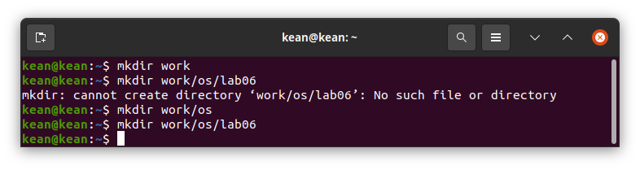
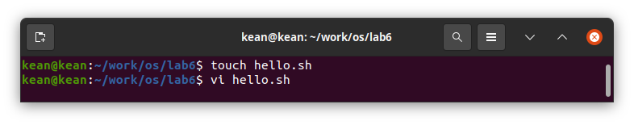
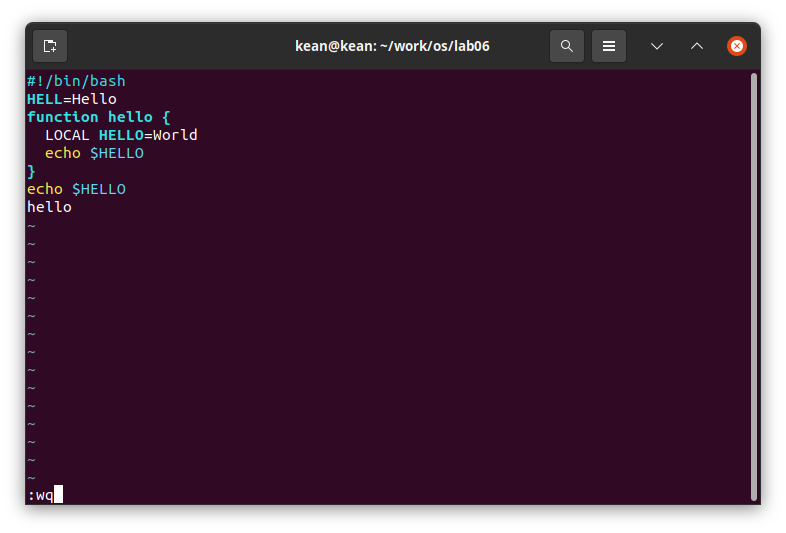
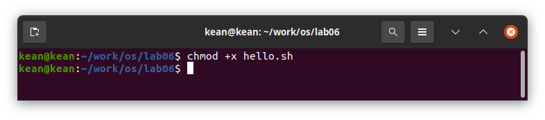

---
## Front matter
lang: ru-RU
title: Текстовой редактор vi
author: |
	 Кеан Путхеаро НПИбд-01-20\inst{1}

institute: |
	\inst{1}Российский Университет Дружбы Народов

date: 21 мая, 2021, Москва, Россия

## Formatting
mainfont: PT Serif
romanfont: PT Serif
sansfont: PT Sans
monofont: PT Mono
toc: false
slide_level: 2
theme: metropolis
header-includes: 
 - \metroset{progressbar=frametitle,sectionpage=progressbar,numbering=fraction}
 - '\makeatletter'
 - '\beamer@ignorenonframefalse'
 - '\makeatother'
aspectratio: 43
section-titles: true

---

# Цели и задачи работы

## Цель лабораторной работы

Познакомиться с операционной системой Linux. Получить практические навыки работы с редактором vi, установленным по умолчанию практически во всех дистрибутивах.

## Задачи лабораторной работы 1

1. Создайте каталог с именем ~/work/os/lab06.
2. Перейдите во вновь созданный каталог.
3. Вызовите vi и создайте файл hello.sh
	vi hello.sh
4. Нажмите клавишу ``i`` и вводите следующий текст.
	#!/bin/bash
	HELL=Hello
	function hello {
		LOCAL HELLO=World
		echo $HELLO
	}
	echo $HELLO
	hello
	
## Задачи лабораторной работы 1

5. Нажмите клавишу ``Esc`` для перехода в командный режим после завершения ввода текста.
6. Нажмите ``:`` для перехода в режим последней строки и внизу вашего экранапоявится приглашение в виде двоеточия.
7. Нажмите ``w`` (записать) и ``q`` (выйти), а затем нажмите клавишу ``Enter`` для сохранения вашего текста и завершения работы.
8. Сделайте файл исполняемым
	chmod +x hello.sh

## Задачи лабораторной работы 2

1. Вызовите vi на редактирование файла
	vi ~/work/os/lab06/hello.sh
2. Установите курсор в конец слова HELL второй строки.
3. Перейдите в режим вставки и замените на HELLO. Нажмите ``Esc`` для возврата в командный режим.
4. Установите курсор на четвертую строку и сотрите слово LOCAL.
5. Перейдите в режим вставки и наберите следующий текст: local, нажмите ``Esc`` для возврата в командный режим.

## Задачи лабораторной работы 2

6. Установите курсор на последней строке файла. Вставьте после неё строку, содержащую следующий текст: echo $HELLO.
7. Нажмите ``Esc`` для перехода в командный режим.
8. Удалите последнюю строку.
9. Введите команду отмены изменений ``u`` для отмены последней команды.
10. Введите символ ``:`` для перехода в режим последней строки. Запишите произведённые изменения и выйдите из vi.

# Процесс выполнения лабораторной работы

## создание файла

{ #fig:001 width=70% }

## редактирование файла

{ #fig:002 width=70% }

## редактирование файла

{ #fig:003 width=70% }

## права доступа

{ #fig:004 width=70% }

# Выводы по проделанной работе

## Вывод

Познакомился с операционной системой Linux.А также, я получил практические навыки работы с редактором vi, установленным по умолчанию практически во всех дистрибутивах.