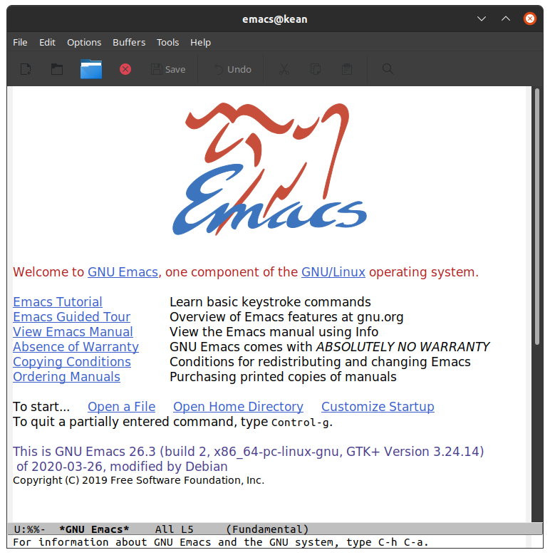
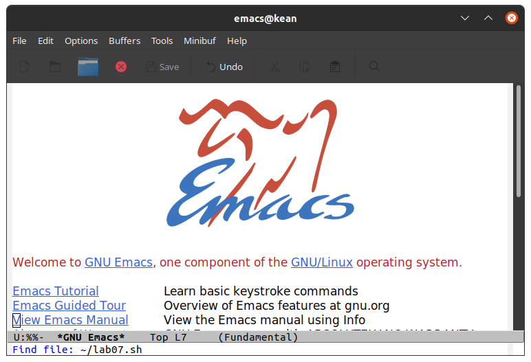
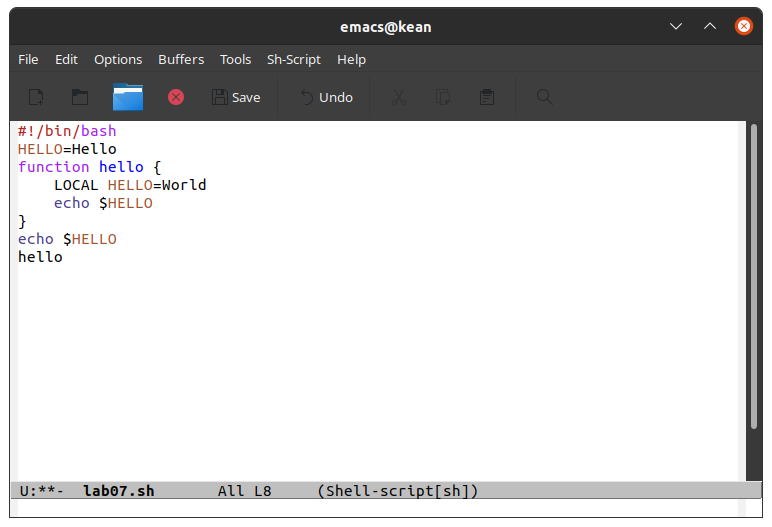
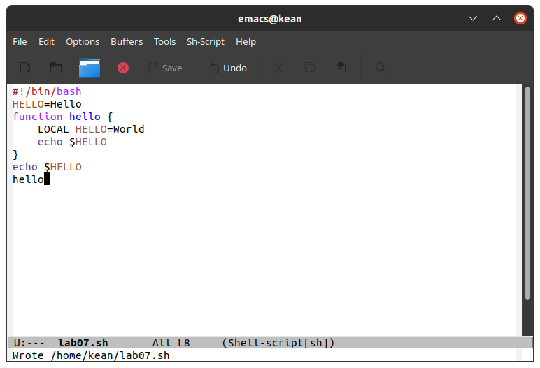
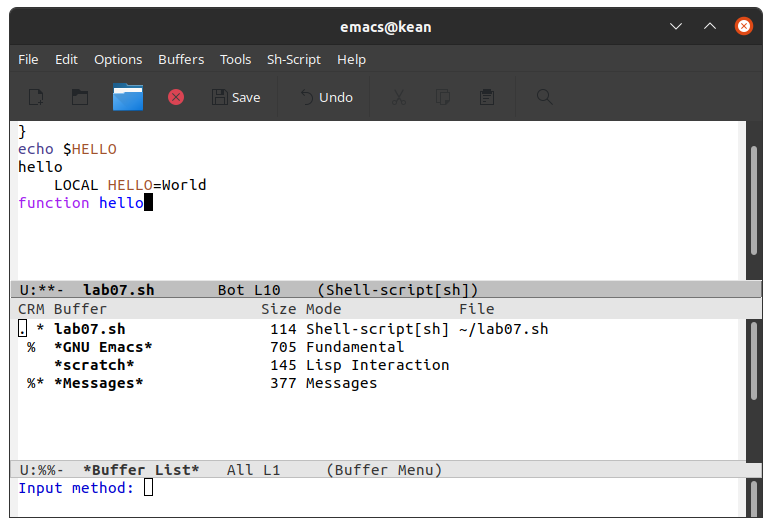
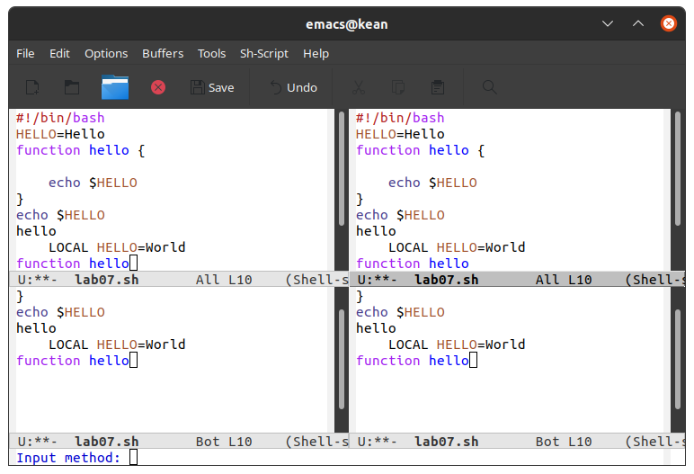
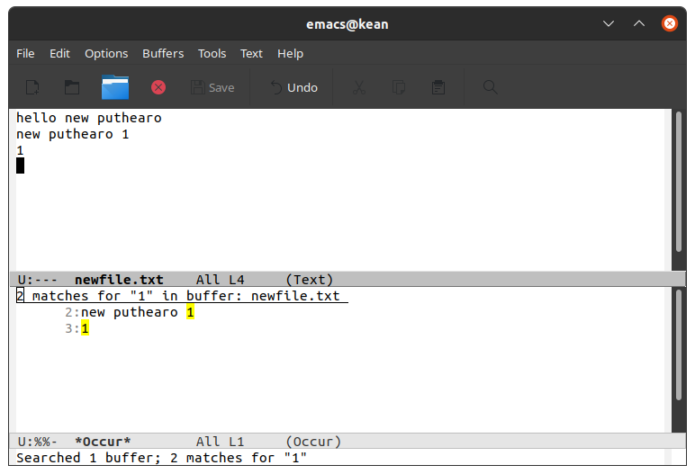

---
## Front matter
lang: ru-RU
title: Текстовой редактор emacs
author: |
	 Кеан Путхеаро НПИбд-01-20\inst{1}

institute: |
	\inst{1}Российский Университет Дружбы Народов

date: 13 мая, 2021, Москва, Россия

## Formatting
mainfont: PT Serif
romanfont: PT Serif
sansfont: PT Sans
monofont: PT Mono
toc: false
slide_level: 2
theme: metropolis
header-includes: 
 - \metroset{progressbar=frametitle,sectionpage=progressbar,numbering=fraction}
 - '\makeatletter'
 - '\beamer@ignorenonframefalse'
 - '\makeatother'
aspectratio: 43
section-titles: true

---

# Цели и задачи работы

## Цель лабораторной работы

Познакомиться с операционной системой Linux. Получить практические навыки работы с редактором Emacs.

## Задачи лабораторной работы

1. Открыть emacs.
2. Создать файл lab07.sh с помощью комбинации ``Ctrl-x`` ``Ctrl-f`` (C-x C-f).
3. Наберите текст:
	#!/bin/bash
	HELL=Hello
	function hello {
		LOCAL HELLO=World
		echo $HELLO
	}
	echo $HELLO
	hello
4. Сохранить файл с помощью комбинации Ctrl-x Ctrl-s (C-x C-s)

## Задачи лабораторной работы

5. Проделать с текстом стандартные процедуры редактирования, каждое действие должно осуществляться комбинацией клавиш
6. Научитесь использовать команды по перемещению курсора
7. Управление буферами
8. Управление окнами
9. Режим поиска

# Процесс выполнения лабораторной работы

## emacs

{ #fig:001 width=70% }

## Создал файл lab07.sh

{ #fig:002 width=70% }

## Набрал текст

{ #fig:003 width=70% }

## Сохранил файл

{ #fig:004 width=70% }

## Управление буферами

{ #fig:005 width=70% }

## Управление окнами

{ #fig:006 width=70% }

## Режим поиска

{ #fig:007 width=70% }

# Выводы по проделанной работе

## Вывод

Познакомился с операционной системой Linux. Получил практические навыки работы с редактором Emacs.