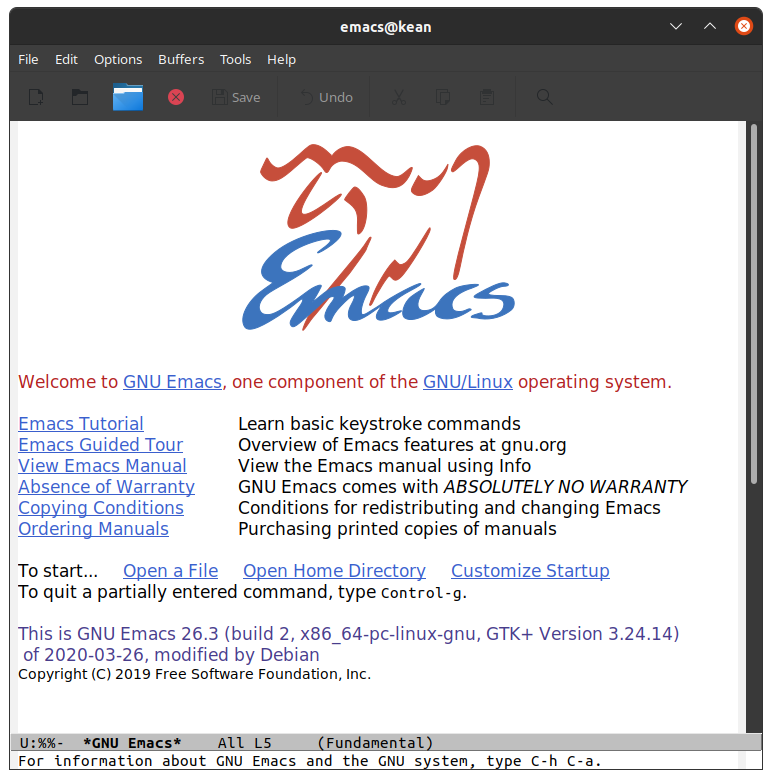
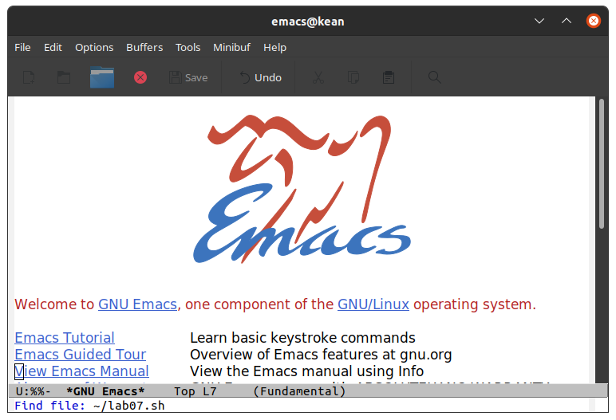
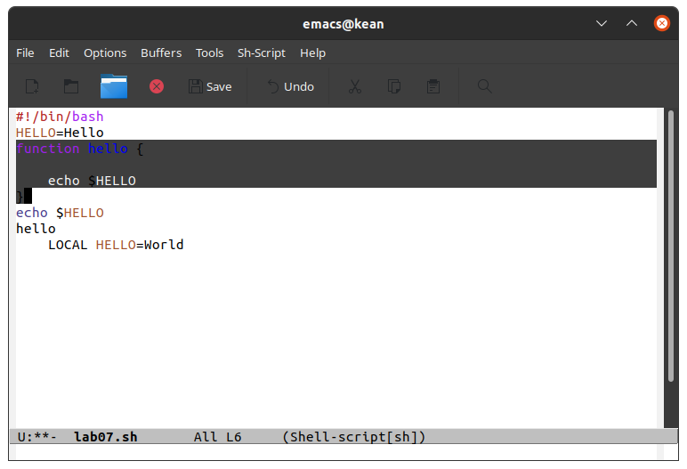
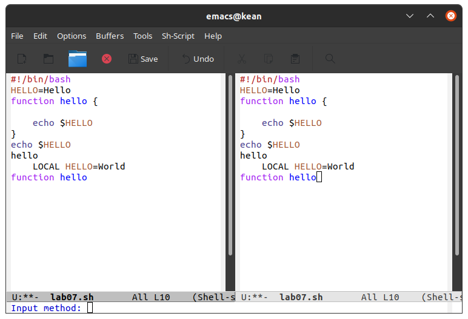
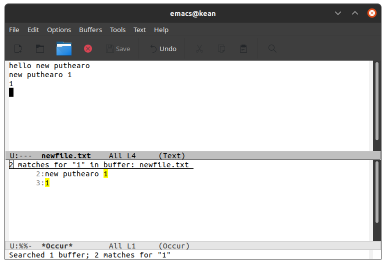

---
# Front matter
lang: ru-RU
title: "Лабораторная работа No 10"
subtitle: "Текстовой редактор emacs"
author: "Кеан Путхеаро НПИбд-01-20"

# Formatting
toc-title: "Содержание"
toc: true # Table of contents
toc_depth: 2
lof: true # List of figures
lot: false # List of tables
fontsize: 12pt
linestretch: 1.5
papersize: a4paper
documentclass: scrreprt
polyglossia-lang: russian
polyglossia-otherlangs: english
mainfont: PT Serif
romanfont: PT Serif
sansfont: PT Sans
monofont: PT Mono
mainfontoptions: Ligatures=TeX
romanfontoptions: Ligatures=TeX
sansfontoptions: Ligatures=TeX,Scale=MatchLowercase
monofontoptions: Scale=MatchLowercase
indent: true
pdf-engine: lualatex
header-includes:
  - \linepenalty=10 # the penalty added to the badness of each line within a paragraph (no associated penalty node) Increasing the value makes tex try to have fewer lines in the paragraph.
  - \interlinepenalty=0 # value of the penalty (node) added after each line of a paragraph.
  - \hyphenpenalty=50 # the penalty for line breaking at an automatically inserted hyphen
  - \exhyphenpenalty=50 # the penalty for line breaking at an explicit hyphen
  - \binoppenalty=700 # the penalty for breaking a line at a binary operator
  - \relpenalty=500 # the penalty for breaking a line at a relation
  - \clubpenalty=150 # extra penalty for breaking after first line of a paragraph
  - \widowpenalty=150 # extra penalty for breaking before last line of a paragraph
  - \displaywidowpenalty=50 # extra penalty for breaking before last line before a display math
  - \brokenpenalty=100 # extra penalty for page breaking after a hyphenated line
  - \predisplaypenalty=10000 # penalty for breaking before a display
  - \postdisplaypenalty=0 # penalty for breaking after a display
  - \floatingpenalty = 20000 # penalty for splitting an insertion (can only be split footnote in standard LaTeX)
  - \raggedbottom # or \flushbottom
  - \usepackage{float} # keep figures where there are in the text
  - \floatplacement{figure}{H} # keep figures where there are in the text
---

# Цель работы

Познакомиться с операционной системой Linux. Получить практические навыки работы с редактором Emacs.

# Задание

1. Открыть emacs.
2. Создать файл lab07.sh с помощью комбинации ``Ctrl-x`` ``Ctrl-f`` (C-x C-f).
3. Наберите текст:
	#!/bin/bash
	HELL=Hello
	function hello {
		LOCAL HELLO=World
		echo $HELLO
	}
	echo $HELLO
	hello

4. Сохранить файл с помощью комбинации Ctrl-x Ctrl-s (C-x C-s).

5. Проделать с текстом стандартные процедуры редактирования, каждое действие должно осуществляться комбинацией клавиш.
5.1. Вырезать одной командой целую строку (С-k).
5.2. Вставить эту строку в конец файла (C-y).
5.3. Выделить область текста (C-space).
5.4. Скопировать область в буфер обмена (M-w).
5.5. Вставить область в конец файла.
5.6. Вновь выделить эту область и на этот раз вырезать её (C-w).
5.7. Отмените последнее действие (C-/).

6. Научитесь использовать команды по перемещению курсора.
6.1. Переместите курсор в начало строки (C-a).
6.2. Переместите курсор в конец строки (C-e).
6.3. Переместите курсор в начало буфера (M-<).
6.4. Переместите курсор в конец буфера (M->).

7. Управление буферами.
7.1. Вывести список активных буферов на экран (C-x C-b).
7.2. Переместитесь во вновь открытое окно (C-x) o со списком открытых буферов и переключитесь на другой буфер.
7.3. Закройте это окно (C-x 0).
7.4. Теперь вновь переключайтесь между буферами, но уже без вывода их списка на экран (C-x b).

8. Управление окнами.
8.1. Поделите фрейм на 4 части: разделите фрейм на два окна по вертикали(C-x 3), а затем каждое из этих окон на две части по горизонтали (C-x 2)
8.2. В каждом из четырёх созданных окон откройте новый буфер (файл) и введите несколько строк текста.

9. Режим поиска
9.1. Переключитесь в режим поиска (C-s) и найдите несколько слов, присутствующих в тексте.
9.2. Переключайтесь между результатами поиска, нажимая C-s.
9.3. Выйдите из режима поиска, нажав C-g.
9.4. Перейдите в режим поиска и замены (M-%), введите текст, который следует найти и заменить, нажмите ``Enter`` , затем введите текст для замены. После того как будут подсвечены результаты поиска, нажмите ! для подтверждения замены.
9.5. Испробуйте другой режим поиска, нажав M-s o. Объясните, чем он отличается от обычного режима?

# Выполнение лабораторной работы

1. Открыл emacs.

{ #fig:001 width=70% }

2. Создал файл lab07.sh с помощью комбинации ``Ctrl-x`` ``Ctrl-f`` (C-x C-f).

{ #fig:002 width=70% }

{ #fig:003 width=70% }

3. Набрал текст

{ #fig:004 width=70% }

4. Сохранил файл с помощью комбинации Ctrl-x Ctrl-s (C-x C-s).

{ #fig:005 width=70% }

5. Проделать с текстом стандартные процедуры редактирования, каждое действие должно осуществляться комбинацией клавиш.

5.1. Вырезал одной командой целую строку (С-k).

{ #fig:006 width=70% }

5.2. Вставил эту строку в конец файла (C-y).

{ #fig:007 width=70% }

5.3. Выделил область текста (C-space).

5.4. Скопировал область в буфер обмена (M-w).

5.5. Вставил область в конец файла.

5.6. Вновь выделить эту область и на этот раз вырезать её (C-w).

{ #fig:008 width=70% }

{ #fig:009 width=70% }

5.7. Отменил последнее действие (C-/).видим, что вырезанный текст вернулся на свое место.

{ #fig:010 width=70% }

6. Научитесь использовать команды по перемещению курсора.

6.1. Переместил курсор в начало строки (C-a).

{ #fig:011 width=70% }

6.2. Переместил курсор в конец строки (C-e).

{ #fig:012 width=70% }

6.3. Переместил курсор в начало буфера (M-<).

{ #fig:013 width=70% }

6.4. Переместил курсор в конец буфера (M->).

{ #fig:014 width=70% }

7. Управление буферами.

7.1. Вывел список активных буферов на экран (C-x C-b).

{ #fig:015 width=70% }

7.2. Переместился во вновь открытое окно (C-x) o со списком открытых буферов и переключитесь на другой буфер.

{ #fig:016 width=70% }

7.3. Закрыл это окно (C-x 0).

7.4. Теперь вновь переключайтесь между буферами, но уже без вывода их списка на экран (C-x b).

8. Управление окнами.

8.1. Поделил фрейм на 4 части: разделите фрейм на два окна по вертикали(C-x 3), а затем каждое из этих окон на две части по горизонтали (C-x 2)

{ #fig:017 width=70% }

{ #fig:018 width=70% }

8.2. В каждом из четырёх созданных окон открыл новый буфер (файл) и ввел несколько строк текста.

{ #fig:019 width=70% }

{ #fig:020 width=70% }

9. Режим поиска
9.1. Переключился в режим поиска (C-s) и нашел несколько слов, присутствующих в тексте.

{ #fig:021 width=70% }

9.2. Переключился между результатами поиска, нажимая C-s.

{ #fig:022 width=70% }

{ #fig:023 width=70% }

9.3. Вышел из режима поиска, нажав C-g.

9.4. Перешел в режим поиска и замены (M-%), ввел текст, который следует найти и заменить, нажимал ``Enter`` , затем ввел текст для замены. После того как будут подсвечены результаты поиска, нажмите ``!`` для подтверждения замены.

{ #fig:024 width=70% }

{ #fig:025 width=70% }

{ #fig:026 width=70% }

{ #fig:027 width=70% }

9.5. Испробовал другой режим поиска, нажав M-s o. Объясните, чем он отличается от обычного режима?
``M-s`` сразу перешел к тому месту, где находится ввденное слово

{ #fig:028 width=70% }

{ #fig:029 width=70% }

# Вывод

Познакомился с операционной системой Linux. Получил практические навыки работы с редактором Emacs.

