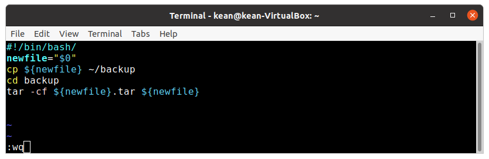
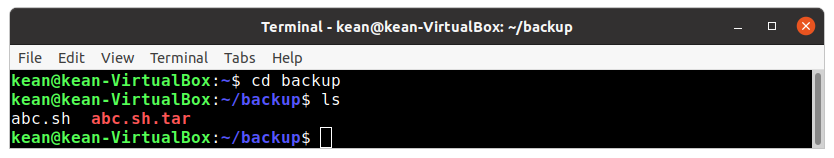
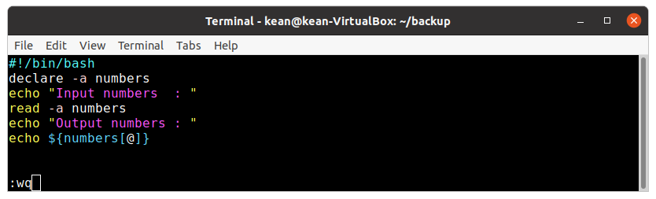
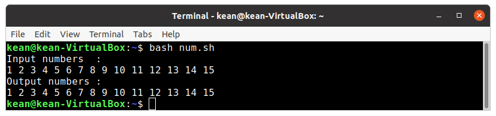
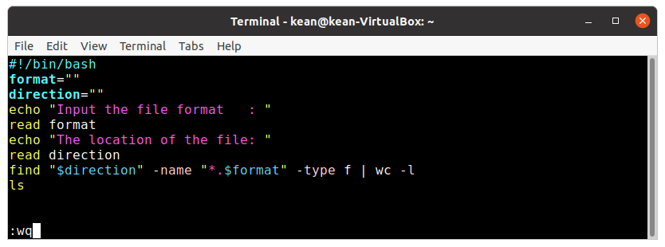
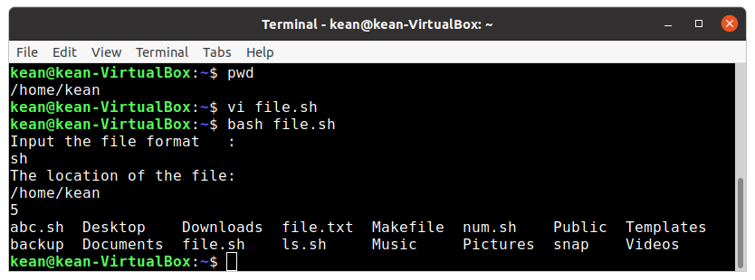

---
## Front matter
lang: ru-RU
title: Программирование в командномпроцессоре ОС UNIX. Командные файлы
author: |
	 Кеан Путхеаро НПИбд-01-20\inst{1}

institute: |
	\inst{1}Российский Университет Дружбы Народов

date: 28 мая, 2021, Москва, Россия

## Formatting
mainfont: PT Serif
romanfont: PT Serif
sansfont: PT Sans
monofont: PT Mono
toc: false
slide_level: 2
theme: metropolis
header-includes: 
 - \metroset{progressbar=frametitle,sectionpage=progressbar,numbering=fraction}
 - '\makeatletter'
 - '\beamer@ignorenonframefalse'
 - '\makeatother'
aspectratio: 43
section-titles: true

---

# Цели и задачи работы

## Цель лабораторной работы

Изучил основы программирования в оболочке ОС UNIX/Linux. Научился писать небольшие командные файлы.

## Задачи лабораторной работы

1. Написать скрипт, который при запуске будет делать резервную копию самого се-бя (то есть файла, в котором содержится его исходный код) в другую директориюbackupв вашем домашнем каталоге. При этом файл должен архивироваться од-ним из архиваторов на выборzip,bzip2илиtar. Способ использования командархивации необходимо узнать, изучив справку.

2. Написать пример командного файла, обрабатывающего любое произвольноечисло аргументов командной строки, в том числепревышающеедесять. Напри-мер, скрипт может последовательно распечатывать значения всех переданныхаргументов.

## Задачи лабораторной работы

3. Написать командный файл — аналог командыls(без использования самой этойкоманды и командыdir). Требуется, чтобы он выдавал информацию о нужномкаталоге и выводил информацию о возможностях доступа к файлам этого ката-лога.

4. Написать командный файл, который получает в качестве аргумента команднойстроки формат файла (.txt,.doc,.jpg,.pdfи т.д.) и вычисляет количествотаких файлов в указанной директории. Путь к директории также передаётся ввиде аргумента командной строки.

# Процесс выполнения лабораторной работы

## создание файла и каталога

{ #fig:002 width=70% }

## проверка работы командного файла

{ #fig:004 width=70% }

## набор текста файла

{ #fig:006 width=70% }

## езультат работы командного файла

{ #fig:007 width=70% }

## результат работы

{ #fig:013 width=70% }

## результат работы

{ #fig:014 width=70% }

# Выводы по проделанной работе

## Вывод

Изучил основы программирования в оболочке ОС UNIX/Linux. Научился писать небольшие командные файлы.

## Библиография

1. (Лабораторная работа №11) https://esystem.rudn.ru/pluginfile.php/1142377/mod_resource/content/2/008-lab_shell_prog_1.pdf

2. (stackexchange) https://vi.stackexchange.com/questions/10209/execute-current-buffer-as-bash-script-from-vim