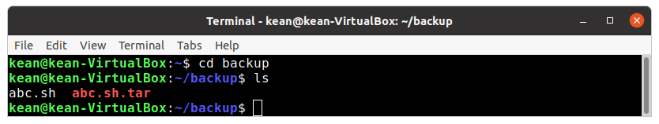
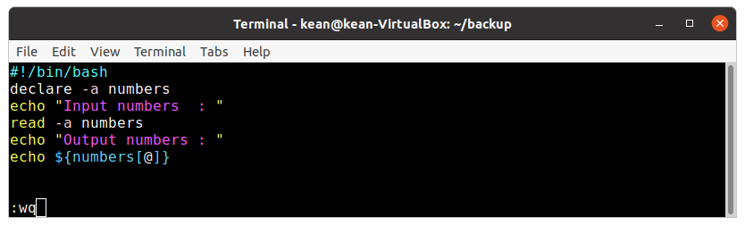
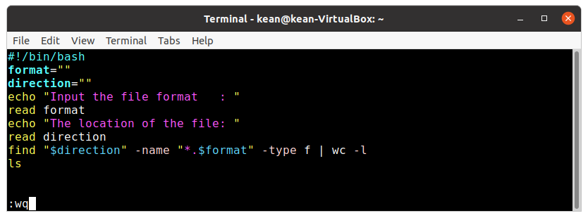
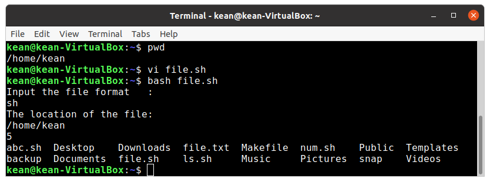

---
# Front matter
lang: ru-RU
title: "Лабораторная работа No 11"
subtitle: "Программирование в командномпроцессоре ОС UNIX. Командные файлы"
author: "Кеан Путхеаро НПИбд-01-20"

# Formatting
toc-title: "Содержание"
toc: true # Table of contents
toc_depth: 2
lof: true # List of figures
lot: false # List of tables
fontsize: 12pt
linestretch: 1.5
papersize: a4paper
documentclass: scrreprt
polyglossia-lang: russian
polyglossia-otherlangs: english
mainfont: PT Serif
romanfont: PT Serif
sansfont: PT Sans
monofont: PT Mono
mainfontoptions: Ligatures=TeX
romanfontoptions: Ligatures=TeX
sansfontoptions: Ligatures=TeX,Scale=MatchLowercase
monofontoptions: Scale=MatchLowercase
indent: true
pdf-engine: lualatex
header-includes:
  - \linepenalty=10 # the penalty added to the badness of each line within a paragraph (no associated penalty node) Increasing the value makes tex try to have fewer lines in the paragraph.
  - \interlinepenalty=0 # value of the penalty (node) added after each line of a paragraph.
  - \hyphenpenalty=50 # the penalty for line breaking at an automatically inserted hyphen
  - \exhyphenpenalty=50 # the penalty for line breaking at an explicit hyphen
  - \binoppenalty=700 # the penalty for breaking a line at a binary operator
  - \relpenalty=500 # the penalty for breaking a line at a relation
  - \clubpenalty=150 # extra penalty for breaking after first line of a paragraph
  - \widowpenalty=150 # extra penalty for breaking before last line of a paragraph
  - \displaywidowpenalty=50 # extra penalty for breaking before last line before a display math
  - \brokenpenalty=100 # extra penalty for page breaking after a hyphenated line
  - \predisplaypenalty=10000 # penalty for breaking before a display
  - \postdisplaypenalty=0 # penalty for breaking after a display
  - \floatingpenalty = 20000 # penalty for splitting an insertion (can only be split footnote in standard LaTeX)
  - \raggedbottom # or \flushbottom
  - \usepackage{float} # keep figures where there are in the text
  - \floatplacement{figure}{H} # keep figures where there are in the text
---

# Цель работы

Изучил основы программирования в оболочке ОС UNIX/Linux. Научился писать небольшие командные файлы.

# Задание

1. Написать скрипт, который при запуске будет делать резервную копию самого се-бя (то есть файла, в котором содержится его исходный код) в другую директориюbackupв вашем домашнем каталоге. При этом файл должен архивироваться од-ним из архиваторов на выборzip,bzip2илиtar. Способ использования командархивации необходимо узнать, изучив справку.

2. Написать пример командного файла, обрабатывающего любое произвольноечисло аргументов командной строки, в том числепревышающеедесять. Напри-мер, скрипт может последовательно распечатывать значения всех переданныхаргументов.
3. Написать командный файл — аналог командыls(без использования самой этойкоманды и командыdir). Требуется, чтобы он выдавал информацию о нужномкаталоге и выводил информацию о возможностях доступа к файлам этого ката-лога.

4. Написать командный файл, который получает в качестве аргумента команднойстроки формат файла (.txt,.doc,.jpg,.pdfи т.д.) и вычисляет количествотаких файлов в указанной директории. Путь к директории также передаётся ввиде аргумента командной строки.

# Выполнение лабораторной работы

1. Написал скрипт, который при запуске будет делать резервную копию самого се-бя (то есть файла, в котором содержится его исходный код) в другую директориюbackupв вашем домашнем каталоге. При этом файл должен архивироваться од-ним из архиваторов на выборzip,bzip2илиtar. Способ использования командархивации необходимо узнать, изучив справку.

{ #fig:001 width=70% }

{ #fig:002 width=70% }

{ #fig:003 width=70% }

Посмотрим на результат его работы - перейдем в каталог резервного копирования, в котором должен был быть создан необходимый архив. Мы видим, что он действительно содержит копию исходного файла и был создан новый архив (рисунок 4). 

{ #fig:004 width=70% }

2. Написал пример командного файла, обрабатывающего любое произвольное число аргументов командной строки, в том числе превышающее десять. Например, скрипт может последовательно распечатывать значения всех переданных аргументов.

{ #fig:005 width=70% }

{ #fig:006 width=70% }

{ #fig:007 width=70% }

3. Написать командный файл — аналог команды ls (без использования самой этой команды и команды dir). Требуется, чтобы он выдавал информацию о нужном каталоге и выводил информацию о возможностях доступа к файлам этого каталога

{ #fig:008 width=70% }

{ #fig:009 width=70% }

{ #fig:010 width=70% }

{ #fig:011 width=70% }

4. Написать командный файл, который получает в качестве аргумента командной строки формат файла (.txt, .doc, .jpg, .pdf и т.д.) и вычисляет количество таких файлов в указанной директории. Путь к директории также передаётся в виде аргумента командной строки.

{ #fig:012 width=70% }

{ #fig:013 width=70% }

{ #fig:014 width=70% }

# Вывод

Изучил основы программирования в оболочке ОС UNIX/Linux. Научился писать небольшие командные файлы.

# Библиография

1. (Лабораторная работа №11) https://esystem.rudn.ru/pluginfile.php/1142377/mod_resource/content/2/008-lab_shell_prog_1.pdf

2. (stackexchange) https://vi.stackexchange.com/questions/10209/execute-current-buffer-as-bash-script-from-vim

