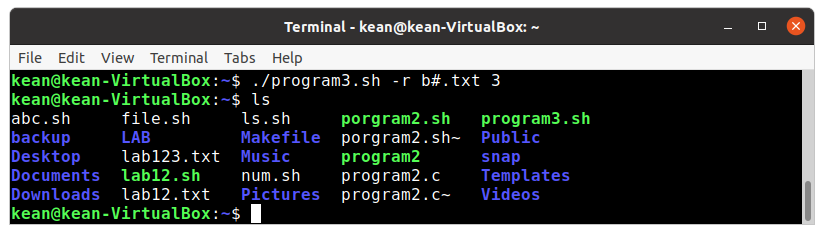

---
# Front matter
lang: ru-RU
title: "Лабораторная работа No 12"
subtitle: "Программирование в командномпроцессоре ОС UNIX. Ветвления и циклы"
author: "Кеан Путхеаро НПИбд-01-20"

# Formatting
toc-title: "Содержание"
toc: true # Table of contents
toc_depth: 2
lof: true # List of figures
lot: false # List of tables
fontsize: 12pt
linestretch: 1.5
papersize: a4paper
documentclass: scrreprt
polyglossia-lang: russian
polyglossia-otherlangs: english
mainfont: PT Serif
romanfont: PT Serif
sansfont: PT Sans
monofont: PT Mono
mainfontoptions: Ligatures=TeX
romanfontoptions: Ligatures=TeX
sansfontoptions: Ligatures=TeX,Scale=MatchLowercase
monofontoptions: Scale=MatchLowercase
indent: true
pdf-engine: lualatex
header-includes:
  - \linepenalty=10 # the penalty added to the badness of each line within a paragraph (no associated penalty node) Increasing the value makes tex try to have fewer lines in the paragraph.
  - \interlinepenalty=0 # value of the penalty (node) added after each line of a paragraph.
  - \hyphenpenalty=50 # the penalty for line breaking at an automatically inserted hyphen
  - \exhyphenpenalty=50 # the penalty for line breaking at an explicit hyphen
  - \binoppenalty=700 # the penalty for breaking a line at a binary operator
  - \relpenalty=500 # the penalty for breaking a line at a relation
  - \clubpenalty=150 # extra penalty for breaking after first line of a paragraph
  - \widowpenalty=150 # extra penalty for breaking before last line of a paragraph
  - \displaywidowpenalty=50 # extra penalty for breaking before last line before a display math
  - \brokenpenalty=100 # extra penalty for page breaking after a hyphenated line
  - \predisplaypenalty=10000 # penalty for breaking before a display
  - \postdisplaypenalty=0 # penalty for breaking after a display
  - \floatingpenalty = 20000 # penalty for splitting an insertion (can only be split footnote in standard LaTeX)
  - \raggedbottom # or \flushbottom
  - \usepackage{float} # keep figures where there are in the text
  - \floatplacement{figure}{H} # keep figures where there are in the text
---

# Цель работы

Изучить основы программирования в оболочке ОС UNIX. Научится писать бо-лее сложные командные файлы с использованием логических управляющих кон-струкций и циклов.

# Задание

1. Используя командыgetopts grep, написать командный файл, который анали-зирует командную строку с ключами:

      –-iinputfile— прочитать данные из указанного файла;

      –-ooutputfile— вывести данные в указанный файл;–-pшаблон— указать шаблон для поиска;

      –-C— различать большие и малые буквы;

      –-n— выдавать номера строк.а затем ищет в указанном файле нужные 
      строки, определяемые ключом-p.

2. Написать на языке Си программу, которая вводит число и определяет, являетсяли оно больше нуля, меньше нуля или равно нулю. Затем программа завершаетсяс помощью функцииexit(n), передавая информацию в о коде завершения воболочку. Командный файл должен вызывать эту программу и, проанализировавс помощью команды$?, выдать сообщение о том, какое число было введено.

3. Написать командный файл, создающий указанное число файлов, пронумерован-ных последовательно от1доN(например1.tmp,2.tmp,3.tmp,4.tmpи т.д.).Число файлов, которые необходимо создать, передаётся в аргументы команднойстроки. Этот же командный файл должен уметь удалять все созданные им файлы(если они существуют).

4. Написать командный файл, который с помощью командыtarзапаковывает вархив все файлы в указанной директории. Модифицировать его так, чтобы запа-ковывались только те файлы, которые были изменены менее недели тому назад(использовать командуfind).

# Выполнение лабораторной работы

1. Используя команды getopts grep, написать командный файл, который анализирует командную строку с ключами: – -iinputfile — прочитать данные из указанного файла; – -ooutputfile — вывести данные в указанный файл; – -pшаблон — указать шаблон для поиска; – -C — различать большие и малые буквы; – -n — выдавать номера строк. а затем ищет в указанном файле нужные строки, определяемые ключом -p.

{ #fig:001 width=70% }

{ #fig:002 width=70% }

{ #fig:003 width=70% }

{ #fig:004 width=70% }

2. Написал на языке Си программу, которая вводит число и определяет, является ли оно больше нуля, меньше нуля или равно нулю. Затем программа завершается с помощью функции exit(n), передавая информацию в о коде завершения в оболочку. Командный файл должен вызывать эту программу и, проанализировав с помощью команды $?, выдать сообщение о том, какое число было введено.

{ #fig:005 width=70% }

{ #fig:006 width=70% }

{ #fig:007 width=70% }

{ #fig:008 width=70% }

3. Написал командный файл, создающий указанное число файлов, пронумерованных последовательно от 1 до N (например 1.tmp, 2.tmp, 3.tmp,4.tmp и т.д.). Число файлов, которые необходимо создать, передаётся в аргументы командной строки. Этот же командный файл должен уметь удалять все созданные им файлы (если они существуют).

{ #fig:009 width=70% }

файлы b1.txt b2.txt b3.txt созданы. 

{ #fig:010 width=70% }

файлы b1.txt b2.txt b3.txt удалены. 

{ #fig:011 width=70% }

4. Написал командный файл, который с помощью команды tar запаковывает в архив все файлы в указанной директории. Модифицировать его так, чтобы запаковывались только те файлы, которые были изменены менее недели тому назад (использовать команду find).

{ #fig:012 width=70% }

{ #fig:013 width=70% }

Итак, New.tar создан. 

{ #fig:014 width=70% }

# Вывод

научился писать более сложные командные файлы с использованием логических управляющих конструкций и циклов.

# Библиография

1. (Лабораторная работа №12) https://esystem.rudn.ru/pluginfile.php/1142380/mod_resource/content/3/009-lab_shell_prog_2.pdf

2. (stackexchange) https://vi.stackexchange.com/questions/10209/execute-current-buffer-as-bash-script-from-vim

3. (BASH: функция getopts — используем опции в скриптах) https://esystem.rudn.ru/pluginfile.php/1142380/mod_resource/content/3/009-lab_shell_prog_2.pdf

4. (stackoverflow) https://stackoverflow.com/questions/16483119/an-example-of-how-to-use-getopts-in-bash

