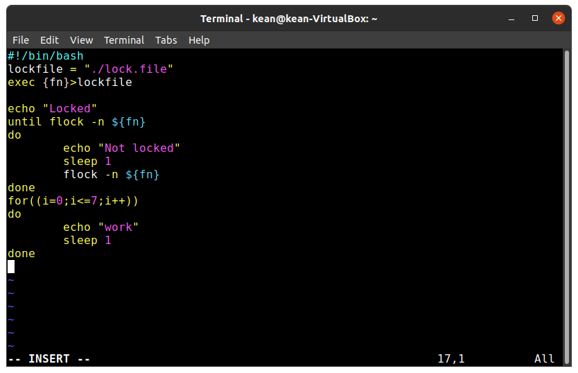
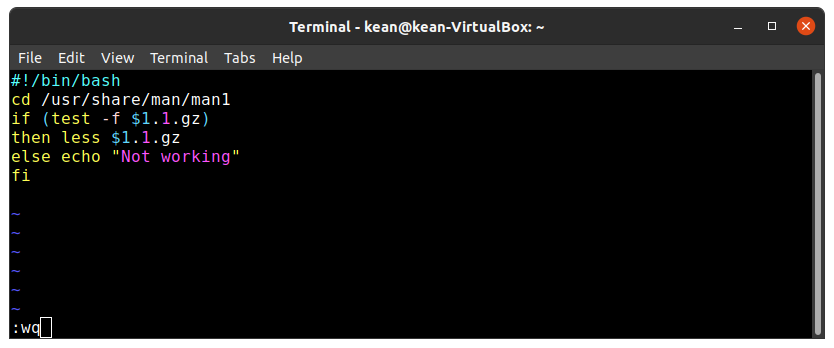

---
## Front matter
lang: ru-RU
title: Программирование в командномпроцессоре ОС UNIX. Расширенное
программирование
author: |
	 Кеан Путхеаро НПИбд-01-20\inst{1}

institute: |
	\inst{1}Российский Университет Дружбы Народов

date: 3 июня, 2021, Москва, Россия

## Formatting
mainfont: PT Serif
romanfont: PT Serif
sansfont: PT Sans
monofont: PT Mono
toc: false
slide_level: 2
theme: metropolis
header-includes: 
 - \metroset{progressbar=frametitle,sectionpage=progressbar,numbering=fraction}
 - '\makeatletter'
 - '\beamer@ignorenonframefalse'
 - '\makeatother'
aspectratio: 43
section-titles: true

---

# Цели и задачи работы

## Цель лабораторной работы

Изучить основы программирования в оболочке ОС UNIX. Научиться писать бо-лее сложные командные файлы с использованием логических управляющих кон-струкций и циклов.

## Задачи лабораторной работы

1. Написать командный файл, реализующий упрощённый механизм семафоров. Ко-мандный файл должен в течение некоторого времениt1дожидаться освобожде-ния ресурса, выдавая об этом сообщение, а дождавшись его освобождения, ис-пользовать его в течение некоторого времениt2<>t1, также выдавая информа-цию о том, что ресурс используется соответствующим командным файлом (про-цессом). Запустить командный файл в одном виртуальном терминале в фоновомрежиме, перенаправив его вывод в другой (> /dev/tty#, где#— номер тер-минала куда перенаправляется вывод), в котором также запущен этот файл, ноне фоновом, а в привилегированном режиме. Доработать программу так, чтобыимелась возможность взаимодействия трёх и более процессов.

## Задачи лабораторной работы

2. Реализовать командуmanс помощью командного файла. Изучите содержимоекаталога/usr/share/man/man1. В нем находятся архивы текстовых файлов,содержащих справку по большинству установленных в системе программ и ко-манд. Каждый архив можно открыть командойlessсразу же просмотрев содер-жимое справки. Командный файл должен получать в виде аргумента команднойстроки название команды и в виде результата выдавать справку об этой коман-де или сообщение об отсутствии справки, если соответствующего файла нет вкаталогеman1.

3. Используя встроенную переменную$RANDOM, напишите командный файл, гене-рирующий случайную последовательность букв латинского алфавита. Учтите,что$RANDOMвыдаёт псевдослучайные числа в диапазоне от 0 до 32767.

# Процесс выполнения лабораторной работы

## vi

{ #fig:001 width=70% }

## vi

{ #fig:003 width=70% }

## vi

{ #fig:006 width=70% }

# Выводы по проделанной работе

## Вывод

В результате работы, я изучил основы программирования в оболочке ОС UNIX. Научился писать более сложные командные файлы с использованием логических управляющих конструкций и циклов

## Библиография

1. (Лабораторная работа №12) https://esystem.rudn.ru/pluginfile.php/1142380/mod_resource/content/3/009-lab_shell_prog_2.pdf

2. (stackexchange) https://vi.stackexchange.com/questions/10209/execute-current-buffer-as-bash-script-from-vim

3. (BASH: функция getopts — используем опции в скриптах) https://esystem.rudn.ru/pluginfile.php/1142380/mod_resource/content/3/009-lab_shell_prog_2.pdf

4. (stackoverflow) https://stackoverflow.com/questions/16483119/an-example-of-how-to-use-getopts-in-bash
