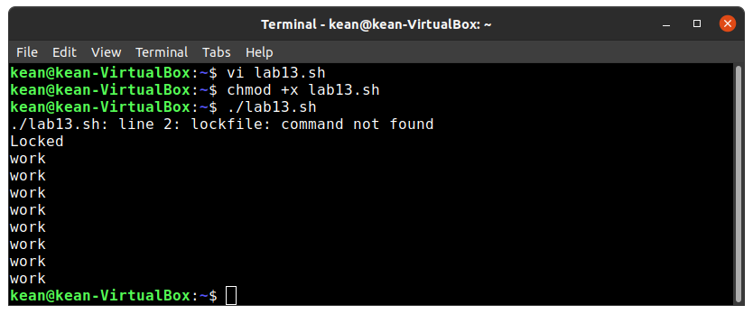
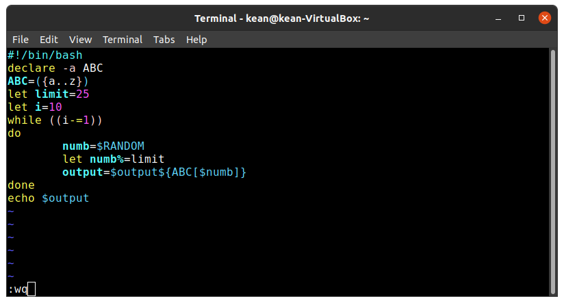

---
# Front matter
lang: ru-RU
title: "Лабораторная работа No 13"
subtitle: "Программирование в командномпроцессоре ОС UNIX. Расширенное программирование"
author: "Кеан Путхеаро НПИбд-01-20"

# Formatting
toc-title: "Содержание"
toc: true # Table of contents
toc_depth: 2
lof: true # List of figures
lot: false # List of tables
fontsize: 12pt
linestretch: 1.5
papersize: a4paper
documentclass: scrreprt
polyglossia-lang: russian
polyglossia-otherlangs: english
mainfont: PT Serif
romanfont: PT Serif
sansfont: PT Sans
monofont: PT Mono
mainfontoptions: Ligatures=TeX
romanfontoptions: Ligatures=TeX
sansfontoptions: Ligatures=TeX,Scale=MatchLowercase
monofontoptions: Scale=MatchLowercase
indent: true
pdf-engine: lualatex
header-includes:
  - \linepenalty=10 # the penalty added to the badness of each line within a paragraph (no associated penalty node) Increasing the value makes tex try to have fewer lines in the paragraph.
  - \interlinepenalty=0 # value of the penalty (node) added after each line of a paragraph.
  - \hyphenpenalty=50 # the penalty for line breaking at an automatically inserted hyphen
  - \exhyphenpenalty=50 # the penalty for line breaking at an explicit hyphen
  - \binoppenalty=700 # the penalty for breaking a line at a binary operator
  - \relpenalty=500 # the penalty for breaking a line at a relation
  - \clubpenalty=150 # extra penalty for breaking after first line of a paragraph
  - \widowpenalty=150 # extra penalty for breaking before last line of a paragraph
  - \displaywidowpenalty=50 # extra penalty for breaking before last line before a display math
  - \brokenpenalty=100 # extra penalty for page breaking after a hyphenated line
  - \predisplaypenalty=10000 # penalty for breaking before a display
  - \postdisplaypenalty=0 # penalty for breaking after a display
  - \floatingpenalty = 20000 # penalty for splitting an insertion (can only be split footnote in standard LaTeX)
  - \raggedbottom # or \flushbottom
  - \usepackage{float} # keep figures where there are in the text
  - \floatplacement{figure}{H} # keep figures where there are in the text
---

# Цель работы

Изучить основы программирования в оболочке ОС UNIX. Научиться писать бо-лее сложные командные файлы с использованием логических управляющих кон-струкций и циклов.

# Задание

1. Написать командный файл, реализующий упрощённый механизм семафоров. Ко-мандный файл должен в течение некоторого времениt1дожидаться освобожде-ния ресурса, выдавая об этом сообщение, а дождавшись его освобождения, ис-пользовать его в течение некоторого времениt2<>t1, также выдавая информа-цию о том, что ресурс используется соответствующим командным файлом (про-цессом). Запустить командный файл в одном виртуальном терминале в фоновомрежиме, перенаправив его вывод в другой (> /dev/tty#, где#— номер тер-минала куда перенаправляется вывод), в котором также запущен этот файл, ноне фоновом, а в привилегированном режиме. Доработать программу так, чтобыимелась возможность взаимодействия трёх и более процессов.

2. Реализовать командуmanс помощью командного файла. Изучите содержимоекаталога/usr/share/man/man1. В нем находятся архивы текстовых файлов,содержащих справку по большинству установленных в системе программ и ко-манд. Каждый архив можно открыть командойlessсразу же просмотрев содер-жимое справки. Командный файл должен получать в виде аргумента команднойстроки название команды и в виде результата выдавать справку об этой коман-де или сообщение об отсутствии справки, если соответствующего файла нет вкаталогеman1.

3. Используя встроенную переменную$RANDOM, напишите командный файл, гене-рирующий случайную последовательность букв латинского алфавита. Учтите,что$RANDOMвыдаёт псевдослучайные числа в диапазоне от 0 до 32767.

# Выполнение лабораторной работы

1. Написал командный файл, реализующий упрощённый механизм семафоров.

{ #fig:001 width=70% }

{ #fig:002 width=70% }

2. Реализовал команду man с помощью командного файла. Изучил содержимое каталога /usr/share/man/man1.

{ #fig:003 width=70% }

{ #fig:004 width=70% }

{ #fig:005 width=70% }

3. Используя встроенную переменную $RANDOM, напишите командный файл, генерирующий случайную последовательность букв латинского алфавита. Учтите,что $RANDOM выдаёт псевдослучайные числа в диапазоне от 0 до 32767.

{ #fig:006 width=70% }

{ #fig:007 width=70% }

# Вывод

В результате работы, я изучил основы программирования в оболочке ОС UNIX. Научился писать более сложные командные файлы с использованием логических управляющих конструкций и циклов

# Библиография

1. (Лабораторная работа №12) https://esystem.rudn.ru/pluginfile.php/1142380/mod_resource/content/3/009-lab_shell_prog_2.pdf

2. (stackexchange) https://vi.stackexchange.com/questions/10209/execute-current-buffer-as-bash-script-from-vim

3. (BASH: функция getopts — используем опции в скриптах) https://esystem.rudn.ru/pluginfile.php/1142380/mod_resource/content/3/009-lab_shell_prog_2.pdf

4. (stackoverflow) https://stackoverflow.com/questions/16483119/an-example-of-how-to-use-getopts-in-bash

