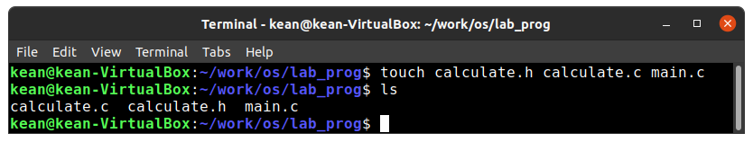
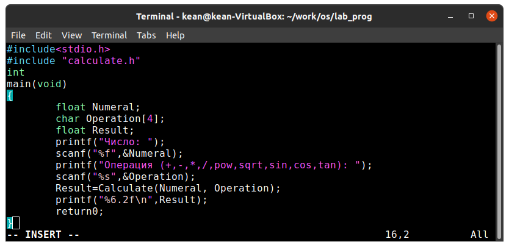

---
## Front matter
lang: ru-RU
title: Средства, применяемые приразработке программного обеспечения в ОС типа UNIX/Linux
author: |
	 Кеан Путхеаро НПИбд-01-20\inst{1}

institute: |
	\inst{1}Российский Университет Дружбы Народов

date: 3 июня, 2021, Москва, Россия

## Formatting
mainfont: PT Serif
romanfont: PT Serif
sansfont: PT Sans
monofont: PT Mono
toc: false
slide_level: 2
theme: metropolis
header-includes: 
 - \metroset{progressbar=frametitle,sectionpage=progressbar,numbering=fraction}
 - '\makeatletter'
 - '\beamer@ignorenonframefalse'
 - '\makeatother'
aspectratio: 43
section-titles: true

---

# Цели и задачи работы

## Цель лабораторной работы

Приобрести простейшие навыки разработки, анализа, тестирования и отладкиприложений в ОС типа UNIX/Linux на примере создания на языке программирова-ния С калькулятора с простейшими функциями.

## Задачи лабораторной работы

1 Написать код приложения

2 Выполнить компиляцию

3 Подготовить Makefile

4 Выполнить отладку в GDB

5 Проанализировать код при помощи splint

# Процесс выполнения лабораторной работы

## каталог

{ #fig:001 width=70% }

## файлы

{ #fig:002 width=70% }

## calculate.h файл

{ #fig:003 width=70% }

## calculate.c файл

{ #fig:004 width=70% }

## main.c файл

{ #fig:005 width=70% }

## Makefile

{ #fig:006 width=70% }

## splint calculate.c

{ #fig:007 width=70% }

# Выводы по проделанной работе

## Вывод

В результате работы , я приобрёл простейшие навыки разработки, анализа, тестирования и отладки приложений в Линукс

## Библиография

1. (Лабораторная работа №14) https://esystem.rudn.ru/pluginfile.php/1142386/mod_resource/content/2/011-lab_prog.pdf

2. (stackexchange) https://vi.stackexchange.com/questions/10209/execute-current-buffer-as-bash-script-from-vim

3. (BASH: функция getopts — используем опции в скриптах) https://esystem.rudn.ru/pluginfile.php/1142380/mod_resource/content/3/009-lab_shell_prog_2.pdf

4. (stackoverflow) https://stackoverflow.com/questions/16483119/an-example-of-how-to-use-getopts-in-bash
