---
# Front matter
lang: ru-RU
title: "Лабораторная работа No 14"
subtitle: "Средства, применяемые приразработке программного обеспечения в ОС типа UNIX/Linux"
author: "Кеан Путхеаро НПИбд-01-20"

# Formatting
toc-title: "Содержание"
toc: true # Table of contents
toc_depth: 2
lof: true # List of figures
lot: false # List of tables
fontsize: 12pt
linestretch: 1.5
papersize: a4paper
documentclass: scrreprt
polyglossia-lang: russian
polyglossia-otherlangs: english
mainfont: PT Serif
romanfont: PT Serif
sansfont: PT Sans
monofont: PT Mono
mainfontoptions: Ligatures=TeX
romanfontoptions: Ligatures=TeX
sansfontoptions: Ligatures=TeX,Scale=MatchLowercase
monofontoptions: Scale=MatchLowercase
indent: true
pdf-engine: lualatex
header-includes:
  - \linepenalty=10 # the penalty added to the badness of each line within a paragraph (no associated penalty node) Increasing the value makes tex try to have fewer lines in the paragraph.
  - \interlinepenalty=0 # value of the penalty (node) added after each line of a paragraph.
  - \hyphenpenalty=50 # the penalty for line breaking at an automatically inserted hyphen
  - \exhyphenpenalty=50 # the penalty for line breaking at an explicit hyphen
  - \binoppenalty=700 # the penalty for breaking a line at a binary operator
  - \relpenalty=500 # the penalty for breaking a line at a relation
  - \clubpenalty=150 # extra penalty for breaking after first line of a paragraph
  - \widowpenalty=150 # extra penalty for breaking before last line of a paragraph
  - \displaywidowpenalty=50 # extra penalty for breaking before last line before a display math
  - \brokenpenalty=100 # extra penalty for page breaking after a hyphenated line
  - \predisplaypenalty=10000 # penalty for breaking before a display
  - \postdisplaypenalty=0 # penalty for breaking after a display
  - \floatingpenalty = 20000 # penalty for splitting an insertion (can only be split footnote in standard LaTeX)
  - \raggedbottom # or \flushbottom
  - \usepackage{float} # keep figures where there are in the text
  - \floatplacement{figure}{H} # keep figures where there are in the text
---

# Цель работы

Приобрести простейшие навыки разработки, анализа, тестирования и отладкиприложений в ОС типа UNIX/Linux на примере создания на языке программирова-ния С калькулятора с простейшими функциями.

# Задание

1. В домашнем каталоге создайте подкаталог ~/work/os/lab_prog.

2. Создайте в нём файлы: calculate.h, calculate.c, main.c. Это будет примитивнейший калькулятор, способный складывать, вычитать, умножать и делить, возводить число в степень, брать квадратный корень, вычислять sin, cos, tan. При запуске он будет запрашивать первое число, операцию, второе число. После этого программа выведет результат и остановится.
Реализация функций калькулятора в файле calculate.h:
////////////////////////////////////
// calculate.c
 #include <stdio.h>
 #include <math.h>
 #include <string.h>
 #include "calculate.h"
float
Calculate(float Numeral, char Operation[4])
{
float SecondNumeral;
if(strncmp(Operation, "+", 1) == 0)
{
printf("Второе слагаемое: ");
scanf("%f",&SecondNumeral);
return(Numeral + SecondNumeral);
}
else if(strncmp(Operation, "-", 1) == 0)
{
printf("Вычитаемое: ");
scanf("%f",&SecondNumeral);
return(Numeral - SecondNumeral);
}
else if(strncmp(Operation, "*", 1) == 0)
{
printf("Множитель: ");
scanf("%f",&SecondNumeral);
return(Numeral * SecondNumeral);
}
else if(strncmp(Operation, "/", 1) == 0)
{
printf("Делитель: ");
scanf("%f",&SecondNumeral);
if(SecondNumeral == 0)
{
printf("Ошибка: деление на ноль! ");
return(HUGE_VAL);
}
else
return(Numeral / SecondNumeral);
}
else if(strncmp(Operation, "pow", 3) == 0)
{
printf("Степень: ");
scanf("%f",&SecondNumeral);
return(pow(Numeral, SecondNumeral));
}
else if(strncmp(Operation, "sqrt", 4) == 0)
return(sqrt(Numeral));
else if(strncmp(Operation, "sin", 3) == 0)
return(sin(Numeral));
else if(strncmp(Operation, "cos", 3) == 0)
return(cos(Numeral));
else if(strncmp(Operation, "tan", 3) == 0)
return(tan(Numeral));
else
{
printf("Неправильно введено действие ");
return(HUGE_VAL);
}
}
Интерфейсный файл calculate.h, описывающий формат вызова функциикалькулятора:
///////////////////////////////////////
// calculate.h
 #ifndef CALCULATE_H_
 #define CALCULATE_H_
float Calculate(float Numeral, char Operation[4]);
 #endif /*CALCULATE_H_*/
Основной файл main.c, реализующий интерфейс пользователя к калькулятору:
////////////////////////////////////////
// main.c

3. Выполните компиляцию программы посредством gcc:
gcc -c calculate.c
gcc -c main.c
gcc calculate.o main.o -o calcul -lm

4. При необходимости исправьте синтаксические ошибки.

5. Создайте Makefile со следующим содержанием:

 Makefile

CC = gcc
CFLAGS =
LIBS = -lm
calcul: calculate.o main.o
gcc calculate.o main.o -o calcul $(LIBS)
calculate.o: calculate.c calculate.h
gcc -c calculate.c $(CFLAGS)
main.o: main.c calculate.h
gcc -c main.c $(CFLAGS)
clean:
-rm calcul *.o *~
 End Makefile
Поясните в отчёте его содержание.

6. С помощью gdb выполните отладку программы calcul (перед использованием
gdb исправьте Makefile):
– Запустите отладчик GDB, загрузив в него программу для отладки:
gdb ./calcul
– Для запуска программы внутри отладчика введите команду run:
run
– Для постраничного (по 9 строк) просмотра исходного код используйте команду list:
list
– Для просмотра строк с 12 по 15 основного файла используйте list с параметрами:
list 12,15
– Для просмотра определённых строк не основного файла используйте list
с параметрами:
list calculate.c:20,29
– Установите точку останова в файле calculate.c на строке номер 21:
list calculate.c:20,27
break 21
– Выведите информацию об имеющихся в проекте точка останова:
info breakpoints
– Запустите программу внутри отладчика и убедитесь, что программа остановится в момент прохождения точки останова:
run
5
-
backtrace
– Отладчик выдаст следующую информацию:
 #0 Calculate (Numeral=5, Operation=0x7fffffffd280 "-")
at calculate.c:21
 #1 0x0000000000400b2b in main () at main.c:17
а команда backtrace покажет весь стек вызываемых функций от начала программы до текущего места.
– Посмотрите, чему равно на этом этапе значение переменной Numeral, введя:
print Numeral
На экран должно быть выведено число 5.
– Сравните с результатом вывода на экран после использования команды:
display Numeral
– Уберите точки останова:
info breakpoints
delete 1

7. С помощью утилиты splint попробуйте проанализировать коды файлов calculate.c и main.c.

# Выполнение лабораторной работы

1. В домашнем каталоге создал подкаталог ~/work/os/lab_prog.

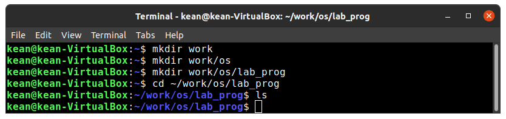{ #fig:001 width=70% }

2. Создал в нём файлы: calculate.h, calculate.c, main.c.

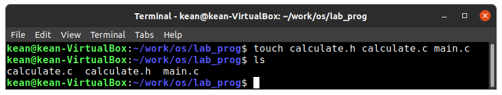{ #fig:002 width=70% }

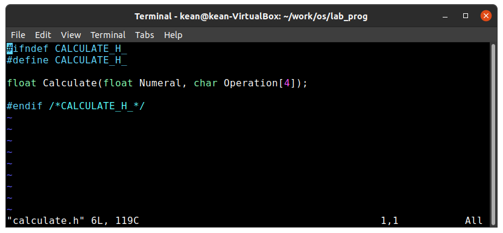{ #fig:003 width=70% }

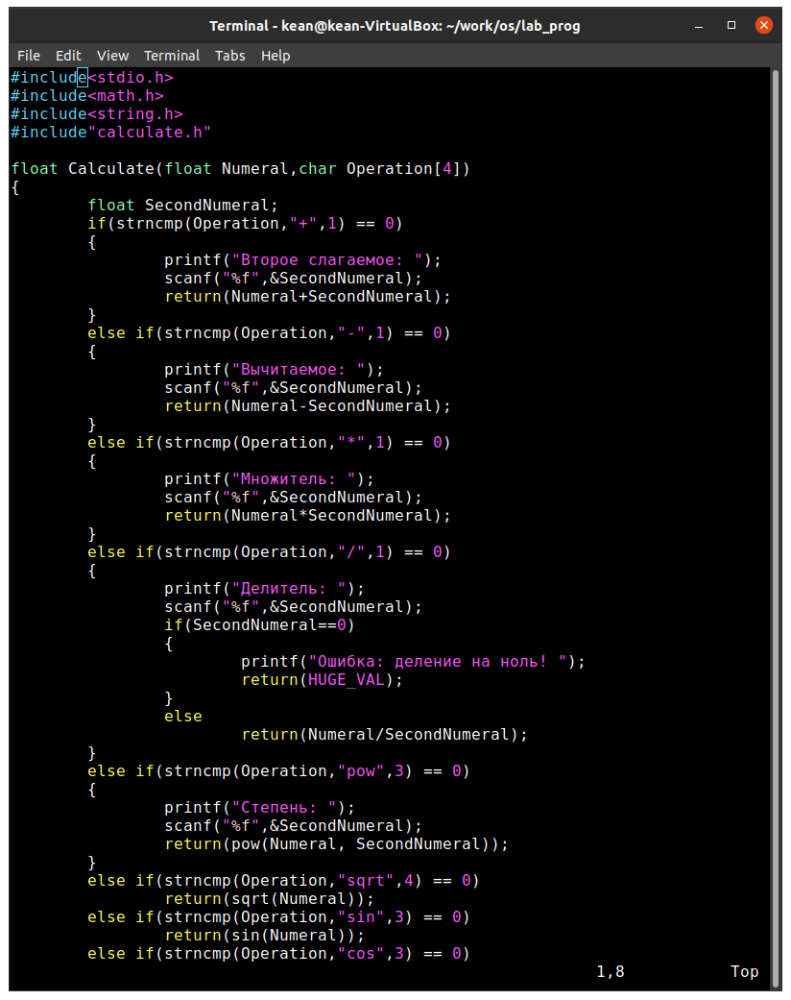{ #fig:004 width=70% }

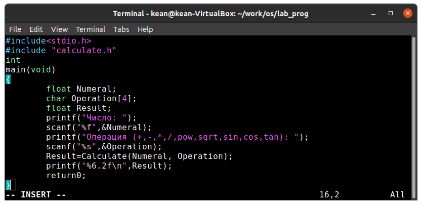{ #fig:005 width=70% }

3. Выполнил компиляцию программы посредством gcc

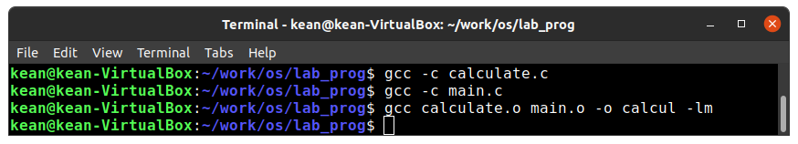{ #fig:006 width=70% }

4. Исправил синтаксические ошибки в файле main.c (удалил & перед operator в линии scanf("%s",&Operation);)

5. Создал Makefile со следующим содержанием

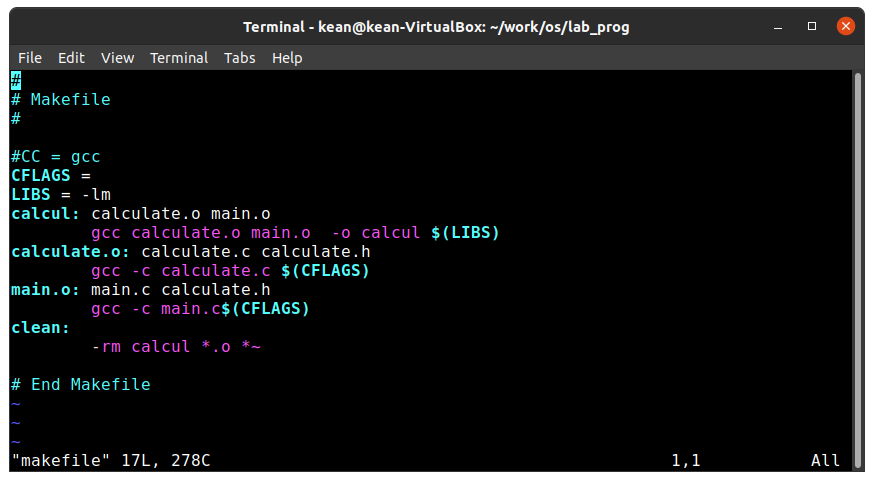{ #fig:007 width=70% }

6. С помощью gdb выполнил отладку программы calcul (перед использованием gdb исправьте Makefile) 

Запустите отладчик GDB, загрузив в него программу для отладки:gdb ./calcul

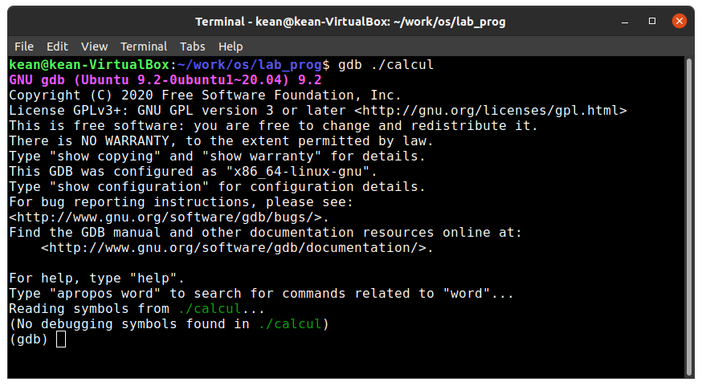{ #fig:008 width=70% }

Для запуска программы внутри отладчика ввел команду run: run

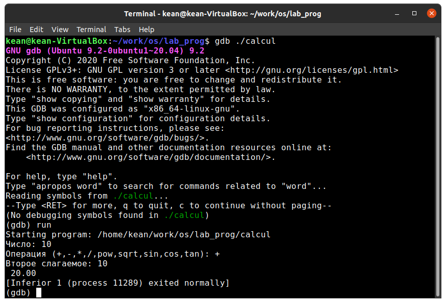{ #fig:009 width=70% }

7. С помощью утилиты splint попробовал проанализировать коды файлов calculate.c и main.c.

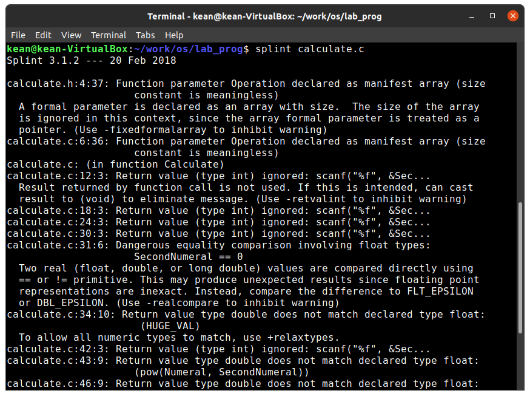{ #fig:010 width=70% }

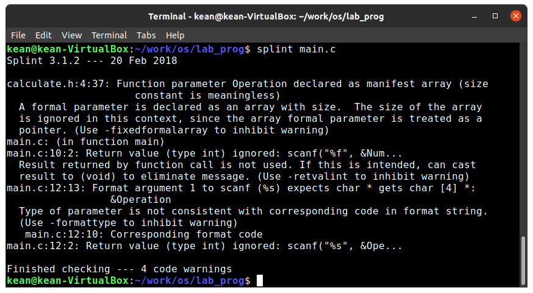{ #fig:011 width=70% }

# Вывод

В результате работы , я приобрёл простейшие навыки разработки, анализа, тестирования и отладки приложений в Линукс

# Библиография

1. (Лабораторная работа №14) https://esystem.rudn.ru/pluginfile.php/1142386/mod_resource/content/2/011-lab_prog.pdf

2. (stackexchange) https://vi.stackexchange.com/questions/10209/execute-current-buffer-as-bash-script-from-vim

3. (BASH: функция getopts — используем опции в скриптах) https://esystem.rudn.ru/pluginfile.php/1142380/mod_resource/content/3/009-lab_shell_prog_2.pdf

4. (stackoverflow) https://stackoverflow.com/questions/16483119/an-example-of-how-to-use-getopts-in-bash

