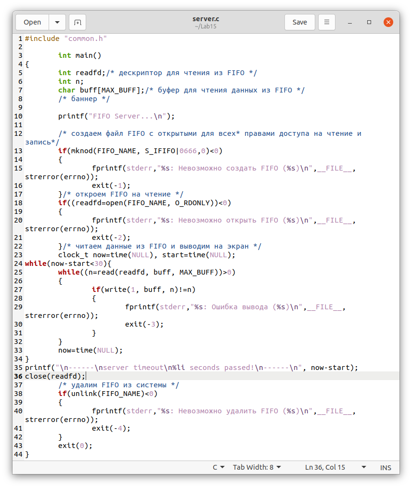
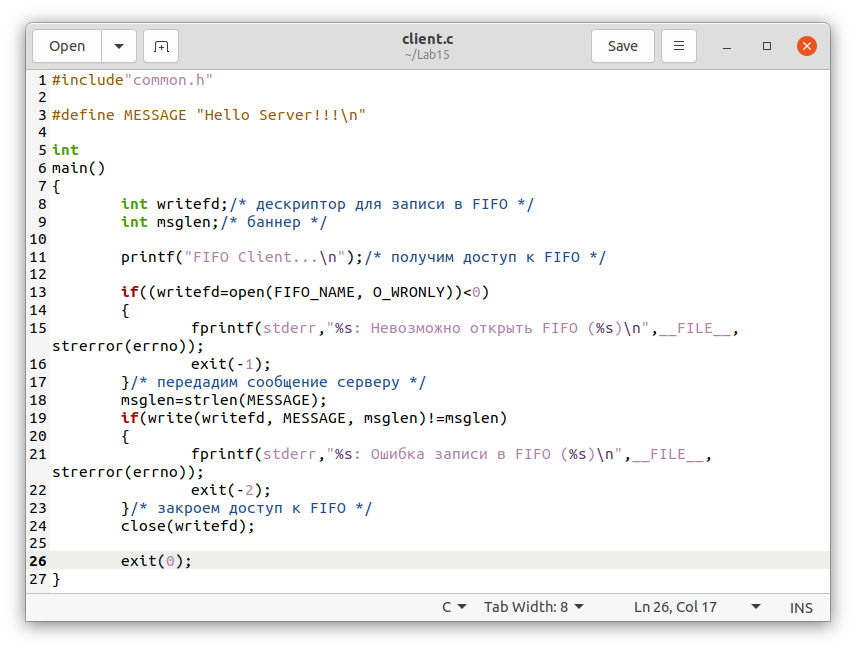
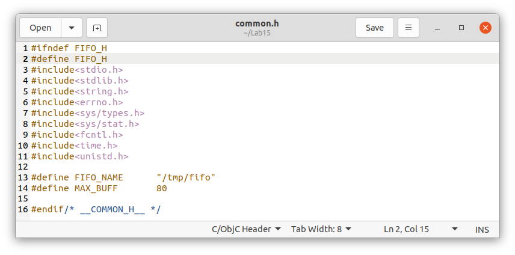
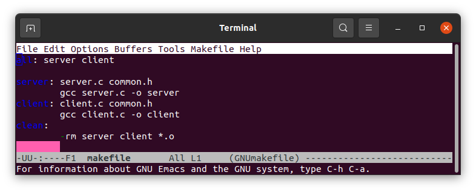
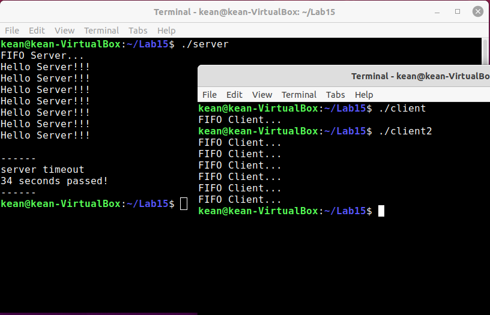

---
## Front matter
lang: ru-RU
title: Именованные каналы
author: |
	 Кеан Путхеаро НПИбд-01-20\inst{1}

institute: |
	\inst{1}Российский Университет Дружбы Народов

date: 12 июня, 2021, Москва, Россия

## Formatting
mainfont: PT Serif
romanfont: PT Serif
sansfont: PT Sans
monofont: PT Mono
toc: false
slide_level: 2
theme: metropolis
header-includes: 
 - \metroset{progressbar=frametitle,sectionpage=progressbar,numbering=fraction}
 - '\makeatletter'
 - '\beamer@ignorenonframefalse'
 - '\makeatother'
aspectratio: 43
section-titles: true

---

# Цели и задачи работы

## Цель лабораторной работы

Приобретение практических навыков работы с именованными каналами.

## Задачи лабораторной работы

Изучите приведённые в тексте программы server.c и client.c. Взяв данные
примеры за образец, напишите аналогичные программы, внеся следующие изменения:

1. Работает не 1 клиент, а несколько (например, два).

2. Клиенты передают текущее время с некоторой периодичностью (например, раз
в пять секунд). Используйте функцию sleep() для приостановки работы клиента.

# Процесс выполнения лабораторной работы

## Server code

{ #fig:001 width=70% }

## Client code

{ #fig:002 width=70% }

## Client2 code

{ #fig:003 width=70% }

## common.h

{ #fig:004 width=70% }

## makefile

{ #fig:005 width=70% }

## результат

{ #fig:006 width=70% }

# Выводы по проделанной работе

## Вывод

В результате работы , я приобрел практические навыки работы с именованными каналами

## Библиография

1. (Лабораторная работа №15) https://esystem.rudn.ru/pluginfile.php/1142389/mod_resource/content/1/013-ipc-fifo.pdf
