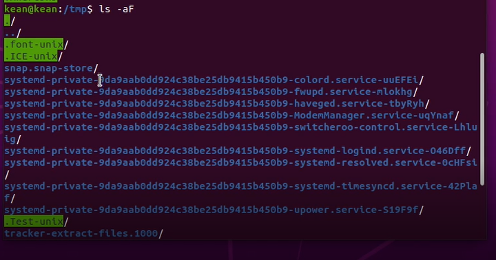
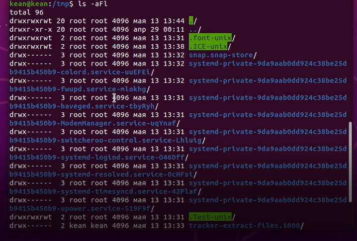
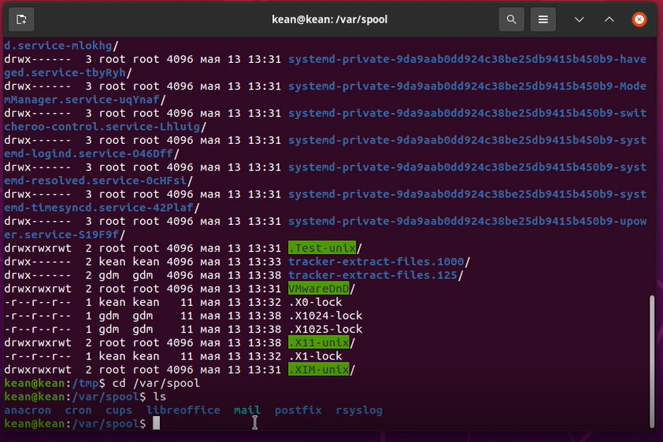
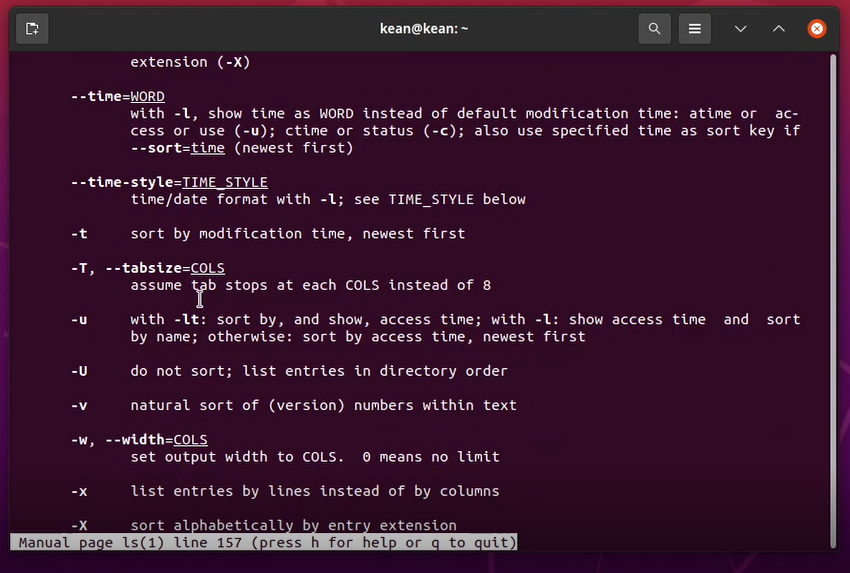
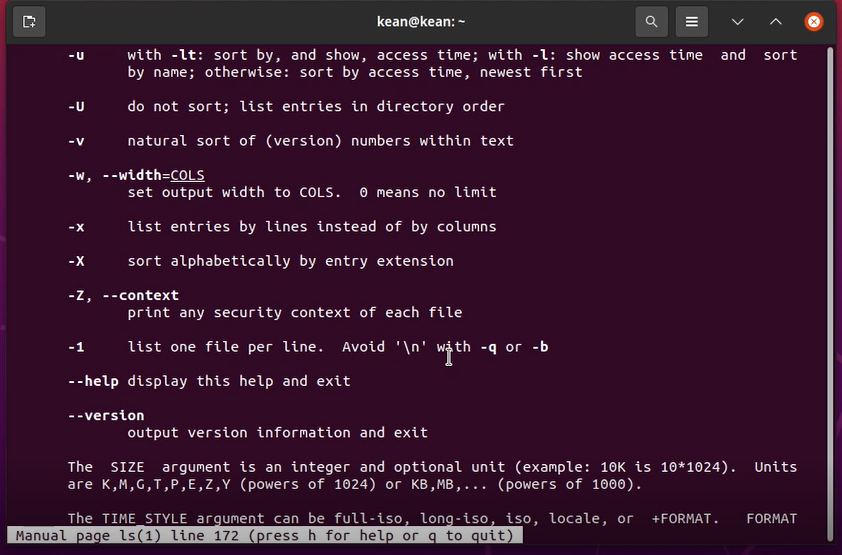
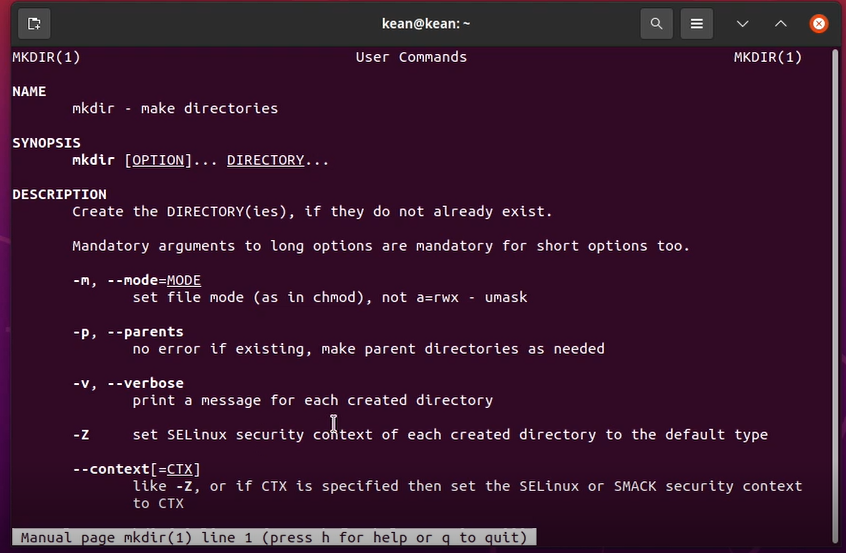
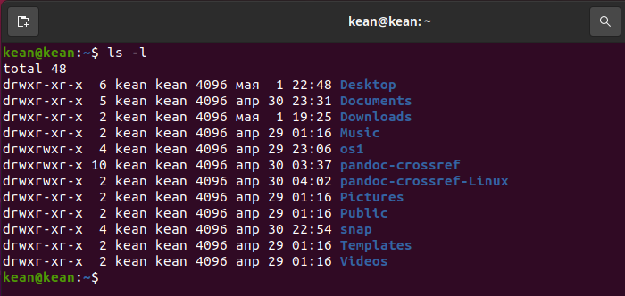

---
# Front matter
lang: ru-RU
title: "Лабораторная работа No 5"
subtitle: "Основы интерфейса взаимодействия пользователя с системой Unix на уровне командной строки"
author: "Кеан Путхеаро НПИбд-01-20"

# Formatting
toc-title: "Содержание"
toc: true # Table of contents
toc_depth: 2
lof: true # List of figures
lot: false # List of tables
fontsize: 12pt
linestretch: 1.5
papersize: a4paper
documentclass: scrreprt
polyglossia-lang: russian
polyglossia-otherlangs: english
mainfont: PT Serif
romanfont: PT Serif
sansfont: PT Sans
monofont: PT Mono
mainfontoptions: Ligatures=TeX
romanfontoptions: Ligatures=TeX
sansfontoptions: Ligatures=TeX,Scale=MatchLowercase
monofontoptions: Scale=MatchLowercase
indent: true
pdf-engine: lualatex
header-includes:
  - \linepenalty=10 # the penalty added to the badness of each line within a paragraph (no associated penalty node) Increasing the value makes tex try to have fewer lines in the paragraph.
  - \interlinepenalty=0 # value of the penalty (node) added after each line of a paragraph.
  - \hyphenpenalty=50 # the penalty for line breaking at an automatically inserted hyphen
  - \exhyphenpenalty=50 # the penalty for line breaking at an explicit hyphen
  - \binoppenalty=700 # the penalty for breaking a line at a binary operator
  - \relpenalty=500 # the penalty for breaking a line at a relation
  - \clubpenalty=150 # extra penalty for breaking after first line of a paragraph
  - \widowpenalty=150 # extra penalty for breaking before last line of a paragraph
  - \displaywidowpenalty=50 # extra penalty for breaking before last line before a display math
  - \brokenpenalty=100 # extra penalty for page breaking after a hyphenated line
  - \predisplaypenalty=10000 # penalty for breaking before a display
  - \postdisplaypenalty=0 # penalty for breaking after a display
  - \floatingpenalty = 20000 # penalty for splitting an insertion (can only be split footnote in standard LaTeX)
  - \raggedbottom # or \flushbottom
  - \usepackage{float} # keep figures where there are in the text
  - \floatplacement{figure}{H} # keep figures where there are in the text
---

# Цель работы

Приобретение практических навыков взаимодействия пользователя с системой
посредством командной строки.

# Задание

1. Определите полное имя вашего домашнего каталога. Далее относительно этого
каталога будут выполняться последующие упражнения.
2. Выполните следующие действия:
- 2.1. Перейдите в каталог /tmp.
- 2.2. Выведите на экран содержимое каталога /tmp. Для этого используйте ко-
манду ls с различными опциями. Поясните разницу в выводимой на экран
информации.
- 2.3. Определите, есть ли в каталоге /var/spool подкаталог с именем cron?
- 2.4. Перейдите в Ваш домашний каталог и выведите на экран его содержимое.
Определите, кто является владельцем файлов и подкаталогов?
3. Выполните следующие действия:
- 3.1. В домашнем каталоге создайте новый каталог с именем newdir.
- 3.2. В каталоге ~/newdir создайте новый каталог с именем morefun.
- 3.3. В домашнем каталоге создайте одной командой три новых каталога с име-
нами letters, memos, misk. Затем удалите эти каталоги одной командой.
- 3.4. Попробуйте удалить ранее созданный каталог ~/newdir командой rm. Про-
верьте, был ли каталог удалён.
- 3.5. Удалите каталог ~/newdir/morefun из домашнего каталога. Проверьте,
был ли каталог удалён.
4. С помощью команды man определите, какую опцию команды ls нужно исполь-
зовать для просмотра содержимое не только указанного каталога, но и подката-
логов, входящих в него.
5. С помощью команды man определите набор опций команды ls, позволяющий от-
сортировать по времени последнего изменения выводимый список содержимого
каталога с развёрнутым описанием файлов.
6. Используйте команду man для просмотра описания следующих команд: cd, pwd,
mkdir, rmdir, rm. Поясните основные опции этих команд.
7. Используя информацию, полученную при помощи команды history, выполните
модификацию и исполнение нескольких команд из буфера команд.


# Выполнение лабораторной работы

1.  Определила полное имя моего домашнего каталога.

2. Перешла в каталог /tmp и вывела его содержимое с помощью команды *ls* с разными опциями.

{ #fig:001 width=70% }

{ #fig:002 width=70% }

{ #fig:003 width=70% }

Определила, есть ли в каталоге /var/spool подкаталог с именем cron.

{ #fig:004 width=70% }

Так же отобразила содержимое домашнего каталога и его владельцев (владелец всех файлов - я).

{ #fig:005 width=70% }

3. Выполните следующие действия
В домашнем каталоге создала новый каталог с именем newdir. А в каталоге ~/newdir создала новый каталог с именем morefun.
В домашнем каталоге создала одной командой три новых каталога с име-
нами letters, memos, misk. Затем удалила их.
Попробовала удалить ранее созданный каталог ~/newdir командой rm. Произошла ошибка. 
Удалила каталог ~/newdir/morefun из домашнего каталога. Проверила.

{ #fig:006 width=70% }

4. С помощью команды man определила, какую опцию команды ls нужно исполь-
зовать для просмотра содержимого не только указанного каталога, но и подката-
логов, входящих в него.

{ #fig:007 width=70% }

5. С помощью команды man определила набор опций команды ls, позволяющий отсортировать по 
времени последнего изменения выводимый список содержимого
каталога с развёрнутым описанием файлов.

{ #fig:008 width=70% }

6. Использовала команду man для просмотра описания следующих команд: cd, pwd,
mkdir, rmdir, rm. Поясните основные опции этих команд.

{ #fig:009 width=70% }

Основные опции cd - переходить по ссылкам и выдавать ошибку если директория не найдена

{ #fig:010 width=70% }

Основные опции pwd - отбрасывать все символические ссылки и отображать справку об утилите и ее версию

{ #fig:011 width=70% }

Основные опции mkdir - назначать режим доступа и выводить сообщение о каждом новом каталоге.

{ #fig:012 width=70% }

Основные опции rmdir - удалять все дочерние каталоги

{ #fig:013 width=70% }

Основные опции rm - рекурсивное удаление, выводить запрос на подтверждение, выводить информацию о удаляемых файлах, игнорировать несуществующие файлы

7. Используя информацию, полученную при помощи команды history, выполнила
модификацию и исполнение команды из буфера команд.

{ #fig:014 width=70% }

# Контрольные вопросы
1. Командная строка является программной оболочкой позволяющей в текстовом виде вводить компьютеру различные команды.
2. Aбсолютный путь к текущему каталогу можно определить с помощью команды pwd.
3. При помощи команды ls и опции -F можно определить только тип файлов и их имена в текущем каталоге.
4. Некоторые файлы в операционной системе скрыты от просмотра и обычно используются для настройки рабочей среды. Имена таких файлов начинаются с точки. Для того, чтобы отобразить имена скрытых файлов, необходимо использовать команду ls с опцией -a.
5. Команда rm используется для удаления файлов и/или каталогов.
6. Команда history выводит список ранее выполненных команд.
7. Можно модифицировать команду из выведенного на экран списка при помощи следующей конструкции:
!<номер_команды>:s/<что_меняем>/<на_что_меняем>
Пример:
```!3:s/a/F ```
8. «;». Если требуется выполнить последовательно несколько команд, записанный в одной строке, то для этого используется символ точка с запятой
Пример:
```cd; ls```
9. Экранирование символов — замена в тексте управляющих символов на соответствующие текстовые подстановки. Если в встречаются специальные символы (типа «.», «/», «*» и т.д.), надо перед ними поставить символ экранирования \ (обратный слэш).
10. Чтобы вывести на экран подробную информацию о файлах и каталогах, необ-
ходимо использовать опцию l. При этом о каждом файле и каталоге будет выведена следующая информация:
– тип файла,
– право доступа,
– число ссылок,
– владелец,
– размер,
– дата последней ревизии,
– имя файла или каталога.
11. Относительный путь представляет собой путь по отношению к текущему рабочему каталогу пользователя или активных приложений. Используется в команде cd. 
12. Команда man используется для просмотра (оперативная помощь) в диалоговом режиме руководства (manual) по основным командам операционной системы типа Linux.
13. TAb служит для автоматического дополнения вводимых команд.
 
# Вывод
> Приобрела практических навыков взаимодействия пользователя с системой
> посредством командной строки. Закрепила исполльзование наиболее распространенных команд.
