---
## Front matter
lang: ru-RU
title: Основы интерфейса взаимодействия пользователя с системой Unix на уровне командной строки
author: |
	 Кеан Путхеаро НПИбд-01-20\inst{1}

institute: |
	\inst{1}Российский Университет Дружбы Народов

date: 13 мая, 2021, Москва, Россия

## Formatting
mainfont: PT Serif
romanfont: PT Serif
sansfont: PT Sans
monofont: PT Mono
toc: false
slide_level: 2
theme: metropolis
header-includes: 
 - \metroset{progressbar=frametitle,sectionpage=progressbar,numbering=fraction}
 - '\makeatletter'
 - '\beamer@ignorenonframefalse'
 - '\makeatother'
aspectratio: 43
section-titles: true

---

# Цели и задачи работы

## Цель лабораторной работы

Приобретение практических навыков взаимодействия пользователя с системой посредством командной строки.

## Задачи лабораторной работы

1 Определить имя и путь домашнего каталога

2 Изучить команду ls.

3 Выполнить действия с каталогами.

4 Получить дополнительные сведения при помощи справки по командам.

5 Изучить команду history.

# Процесс выполнения лабораторной работы

## Имя и путь к домашнему каталогу

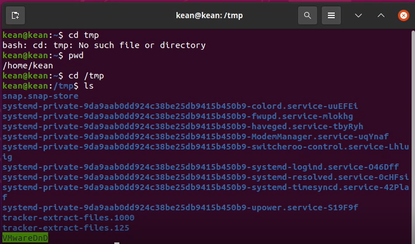{ #fig:001 width=70% }

## Опции команды ls

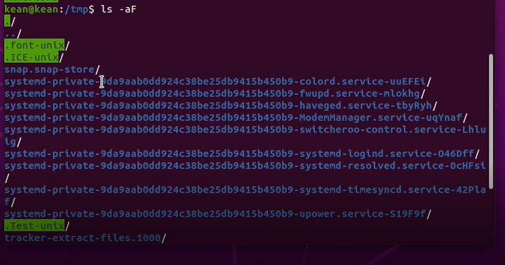{ #fig:002 width=70% }

## Опции команды ls

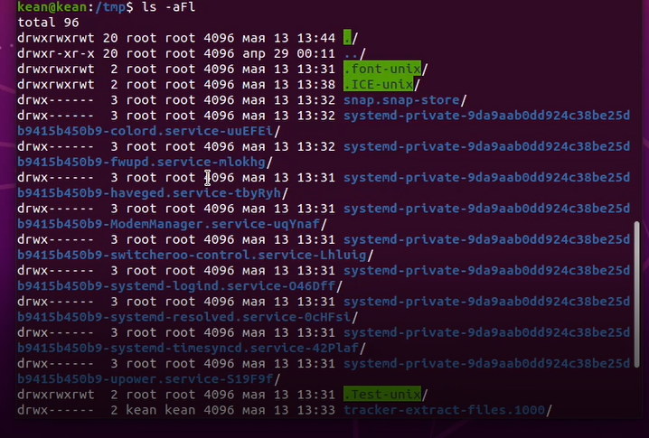{ #fig:003 width=70% }

## Опции команды ls

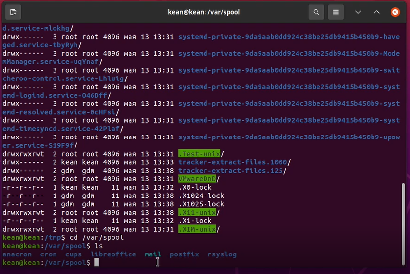{ #fig:004 width=70% }

## Каталог cron

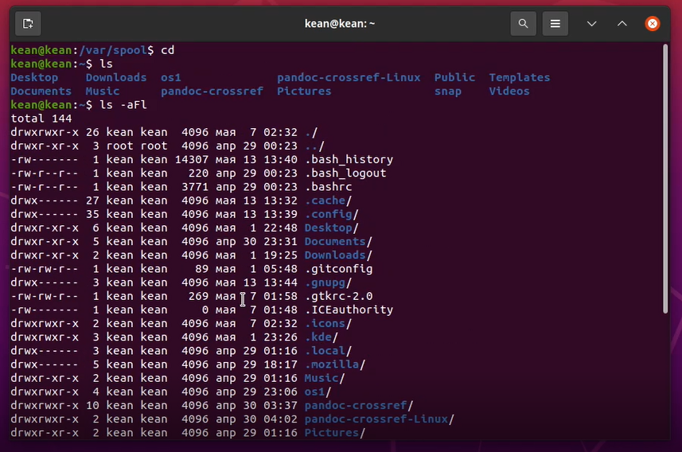{ #fig:005 width=70% }

## Домашний каталог

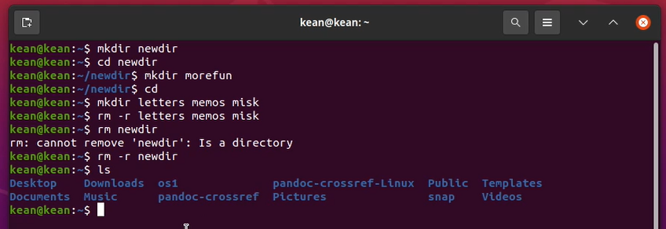{ #fig:006 width=70% }

## Работа с каталогами

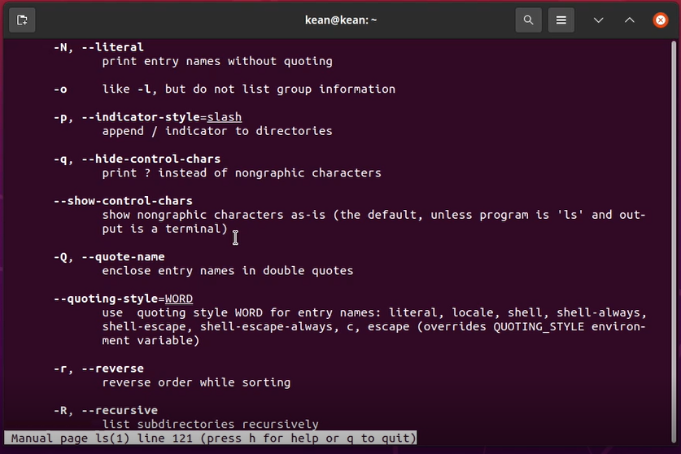{ #fig:007 width=70% }

## Опции команды ls

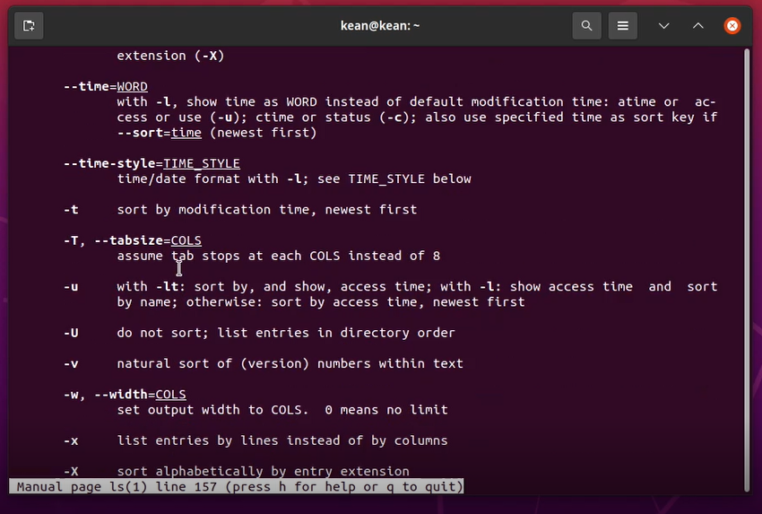{ #fig:008 width=70% }

## Справка по командам

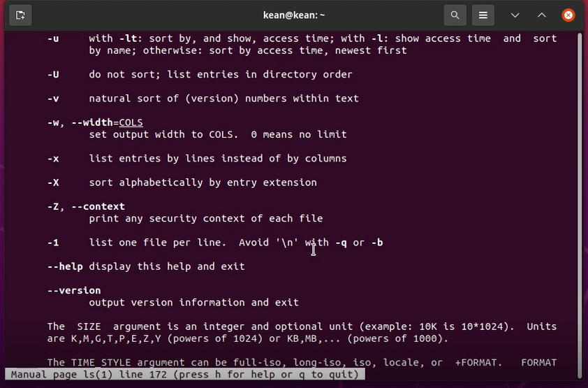{ #fig:009 width=70% }

## Справка по командам

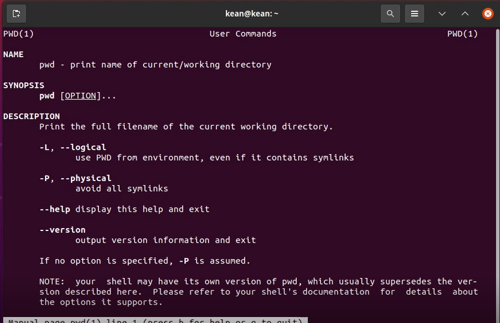{ #fig:010 width=70% }

## Справка по командам

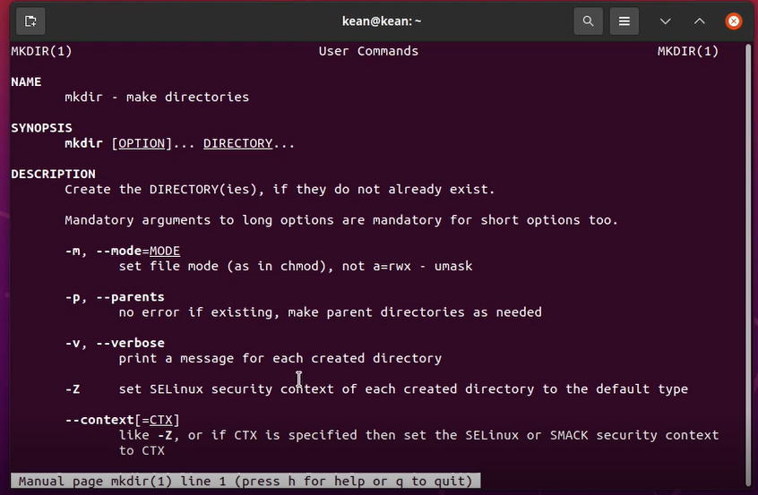{ #fig:011 width=70% }

## Справка по командам

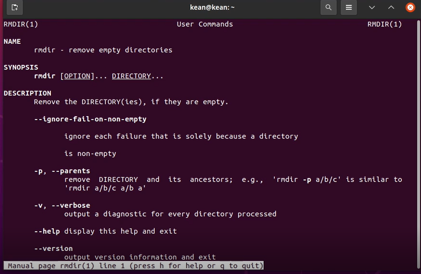{ #fig:012 width=70% }

## Справка по командам

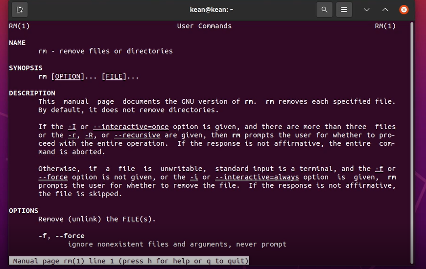{ #fig:013 width=70% }

## История командной строки

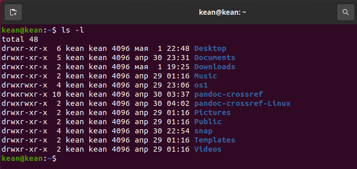{ #fig:014 width=70% }

# Выводы по проделанной работе

## Вывод

> Приобретены практические навыки поведения пользователей с системой
> через струнную систему. Исправлено использование наиболее распространенных команд.