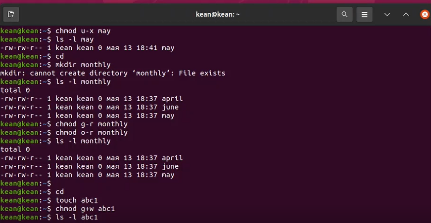
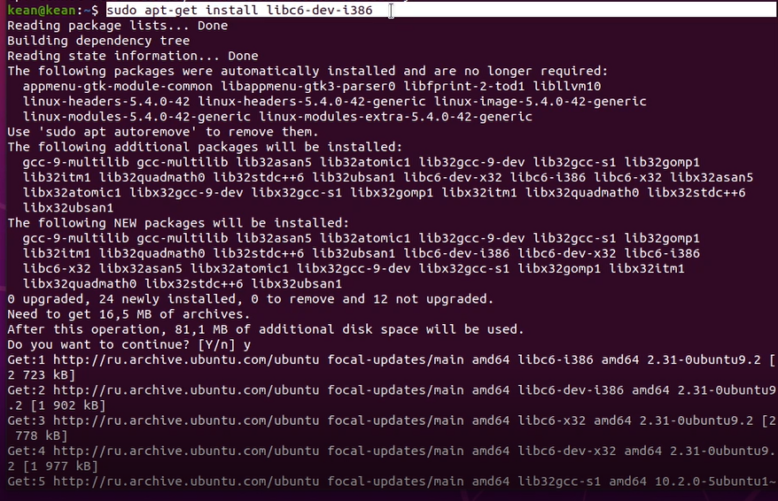
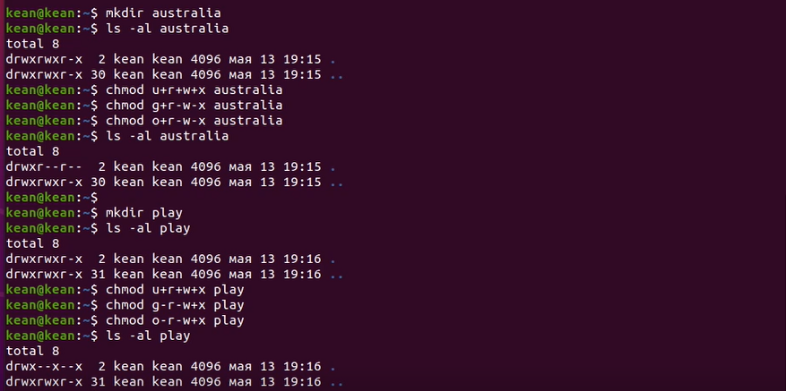
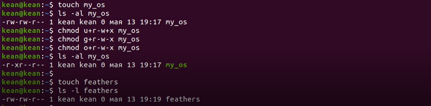
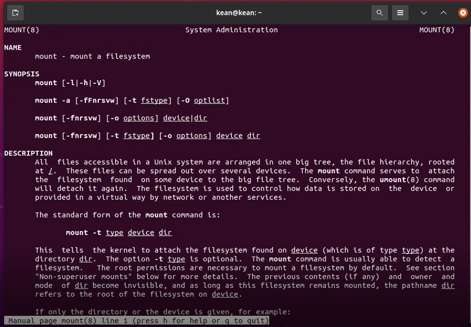
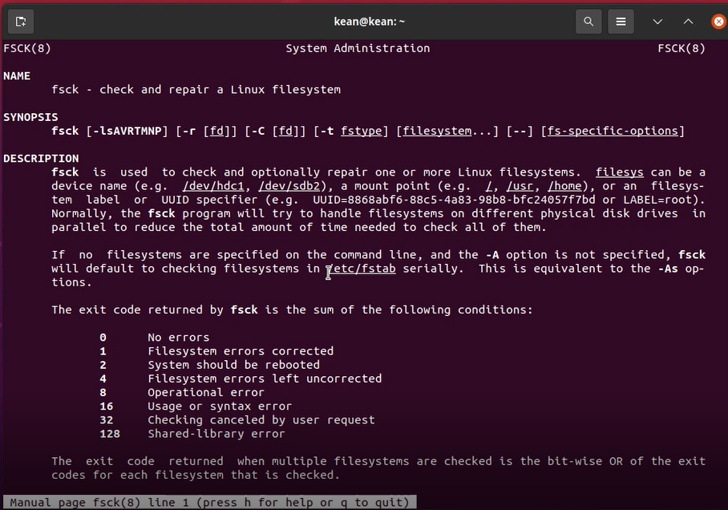
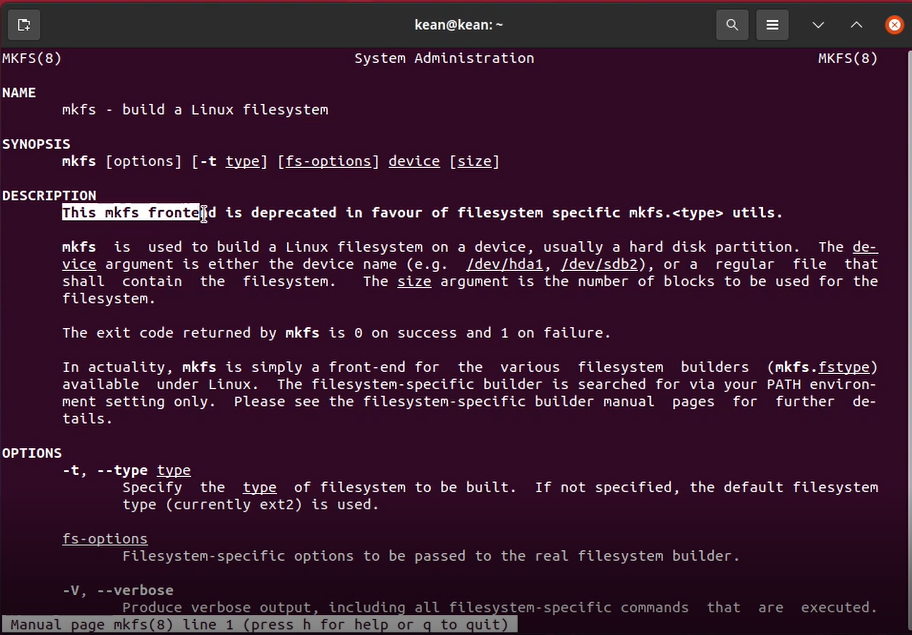

---
## Front matter
lang: ru-RU
title: Анализ файловой структуры UNIX. Команды для работы с файлами и каталогами
author: |
	 Кеан Путхеаро НПИбд-01-20\inst{1}

institute: |
	\inst{1}Российский Университет Дружбы Народов

date: 13 мая, 2021, Москва, Россия

## Formatting
mainfont: PT Serif
romanfont: PT Serif
sansfont: PT Sans
monofont: PT Mono
toc: false
slide_level: 2
theme: metropolis
header-includes: 
 - \metroset{progressbar=frametitle,sectionpage=progressbar,numbering=fraction}
 - '\makeatletter'
 - '\beamer@ignorenonframefalse'
 - '\makeatother'
aspectratio: 43
section-titles: true

---

# Цели и задачи работы

## Цель лабораторной работы

Ознакомление с файловой системой Linux, её структурой, именами и содержанием каталогов. Приобретение практических навыков по применению команд для
работы с файлами и каталогами, по управлению процессами (и работами), по проверке использования диска и обслуживанию файловой системы.

## Задачи лабораторной работы

1. Выполните все примеры, приведённые в первой части описания лабораторной работы.
2. Выполните следующие действия, зафиксировав в отчёте по лабораторной работе используемые при этом команды и результаты их выполнения:
3. Определите опции команды chmod, необходимые для того, чтобы присвоить перечисленным ниже файлам выделенные права доступа, считая, что в начале таких прав нет:
4. Проделайте приведённые ниже упражнения, записывая в отчёт по лабораторной работе используемые при этом команды:
5. Прочитайте man по командам mount, fsck, mkfs, kill и кратко их охарактеризуйте, приведя примеры.

# Процесс выполнения лабораторной работы

## Копирование файлов и каталогов

.png){ #fig:001 width=70% }

## Копирование файлов и каталогов

{ #fig:002 width=70% }

## Перемещение и переименование файлов и каталогов

{ #fig:003 width=70% }

## Изменение прав доступа

.png){ #fig:004 width=70% }

## Изменение прав доступа

{ #fig:005 width=70% }

## sudo apt-get install libc6-dev-i386

{ #fig:006 width=70% }

## команды

{ #fig:007 width=70% }

## команды

{ #fig:008 width=70% }

## Определите опции команды chmod

{ #fig:009 width=70% }

## Определите опции команды chmod

{ #fig:010 width=70% }

## команды

{ #fig:011 width=70% }

## команды

{ #fig:012 width=70% }

## man по командам mount, fsck, mkfs, kill

{ #fig:013 width=70% }

## man mount

{ #fig:014 width=70% }

## man fsck

{ #fig:015 width=70% }

## man mkfs

{ #fig:016 width=70% }

## man kill

{ #fig:017 width=70% }

# Выводы по проделанной работе

## Вывод

Познакомился с файловой системой Linux. Приобрел практические навыки использования команд для работы и обслуживания системных файлов. 