---
# Front matter
lang: ru-RU
title: "Лабораторная работа No 6"
subtitle: "Анализ файловой структуры UNIX. Команды для работы с файлами и каталогами"
author: "Кеан Путхеаро НПИбд-01-20"

# Formatting
toc-title: "Содержание"
toc: true # Table of contents
toc_depth: 2
lof: true # List of figures
lot: false # List of tables
fontsize: 12pt
linestretch: 1.5
papersize: a4paper
documentclass: scrreprt
polyglossia-lang: russian
polyglossia-otherlangs: english
mainfont: PT Serif
romanfont: PT Serif
sansfont: PT Sans
monofont: PT Mono
mainfontoptions: Ligatures=TeX
romanfontoptions: Ligatures=TeX
sansfontoptions: Ligatures=TeX,Scale=MatchLowercase
monofontoptions: Scale=MatchLowercase
indent: true
pdf-engine: lualatex
header-includes:
  - \linepenalty=10 # the penalty added to the badness of each line within a paragraph (no associated penalty node) Increasing the value makes tex try to have fewer lines in the paragraph.
  - \interlinepenalty=0 # value of the penalty (node) added after each line of a paragraph.
  - \hyphenpenalty=50 # the penalty for line breaking at an automatically inserted hyphen
  - \exhyphenpenalty=50 # the penalty for line breaking at an explicit hyphen
  - \binoppenalty=700 # the penalty for breaking a line at a binary operator
  - \relpenalty=500 # the penalty for breaking a line at a relation
  - \clubpenalty=150 # extra penalty for breaking after first line of a paragraph
  - \widowpenalty=150 # extra penalty for breaking before last line of a paragraph
  - \displaywidowpenalty=50 # extra penalty for breaking before last line before a display math
  - \brokenpenalty=100 # extra penalty for page breaking after a hyphenated line
  - \predisplaypenalty=10000 # penalty for breaking before a display
  - \postdisplaypenalty=0 # penalty for breaking after a display
  - \floatingpenalty = 20000 # penalty for splitting an insertion (can only be split footnote in standard LaTeX)
  - \raggedbottom # or \flushbottom
  - \usepackage{float} # keep figures where there are in the text
  - \floatplacement{figure}{H} # keep figures where there are in the text
---

# Цель работы

Ознакомление с файловой системой Linux, её структурой, именами и содержанием каталогов. Приобретение практических навыков по применению команд для
работы с файлами и каталогами, по управлению процессами (и работами), по проверке использования диска и обслуживанию файловой системы.

# Задание

1. Выполните все примеры, приведённые в первой части описания лабораторной работы.
2. Выполните следующие действия, зафиксировав в отчёте по лабораторной работе используемые при этом команды и результаты их выполнения:
     - Скопируйте файл /usr/include/sys/io.h в домашний каталог и назовите
его equipment. Если файла io.h нет, то используйте любой другой файл в
каталоге /usr/include/sys/ вместо него.
     - В домашнем каталоге создайте директорию ~/ski.plases.
     - Переместите файл equipment в каталог ~/ski.plases.
     - Переименуйте файл ~/ski.plases/equipment в ~/ski.plases/equiplist.
     - Создайте в домашнем каталоге файл abc1 и скопируйте его в каталог ~/ski.plases, назовите его equiplist2.
     - Создайте каталог с именем equipment в каталоге ~/ski.plases.
     - Переместите файлы ~/ski.plases/equiplist и equiplist2 в каталог ~/ski.plases/equipment.
     - Создайте и переместите каталог ~/newdir в каталог ~/ski.plases и назо-
вите его plans.
3. Определите опции команды chmod, необходимые для того, чтобы присвоить перечисленным ниже файлам выделенные права доступа, считая, что в начале таких прав нет:
     - drwxr--r-- ... australia
     - drwx--x--x ... play
     - -r-xr--r-- ... my_os
     - -rw-rw-r-- ... feathers
При необходимости создайте нужные файлы.
4. Проделайте приведённые ниже упражнения, записывая в отчёт по лабораторной
работе используемые при этом команды:
     - Просмотрите содержимое файла /etc/password.  
     - Скопируйте файл ~/feathers в файл ~/file.old.
     - Переместите файл ~/file.old в каталог ~/play.
     - Скопируйте каталог ~/play в каталог ~/fun.
     - Переместите каталог ~/fun в каталог ~/play и назовите его games.
     - Лишите владельца файла ~/feathers права на чтение.
     - Что произойдёт, если вы попытаетесь просмотреть файл ~/feathers командой cat?
     - Что произойдёт, если вы попытаетесь скопировать файл ~/feathers?
     - Дайте владельцу файла ~/feathers право на чтение.
     - Лишите владельца каталога ~/play права на выполнение.
     - Перейдите в каталог ~/play. Что произошло?
     - Дайте владельцу каталога ~/play право на выполнение.
5. Прочитайте man по командам mount, fsck, mkfs, kill и кратко их охарактери-
зуйте, приведя примеры.


# Выполнение лабораторной работы

1. Выполните все примеры, приведённые в первой части описания лабораторной работы Material link:

    Копирование файлов и каталогов

    Примеры:

   1. Копирование файла в текущем каталоге. Скопировать файл ~/abc1 в файл april и в файл may :

        С помощью команды ls мы можем видеть новые файлы.
    
   2. Копирование нескольких файлов в каталог. Скопировать файлы april и may в каталог monthly:

   3. Копирование файлов в произвольном каталоге. Скопировать файл monthly/may в файл с именем june:
   
   4. Копирование каталогов в текущем каталоге. Скопировать каталог monthly в каталог monthly.00:
 
   5. Копирование каталогов в произвольном каталоге. Скопировать каталог monthly.00 в каталог /tmp:

     .png){ #fig:001 width=70% }
     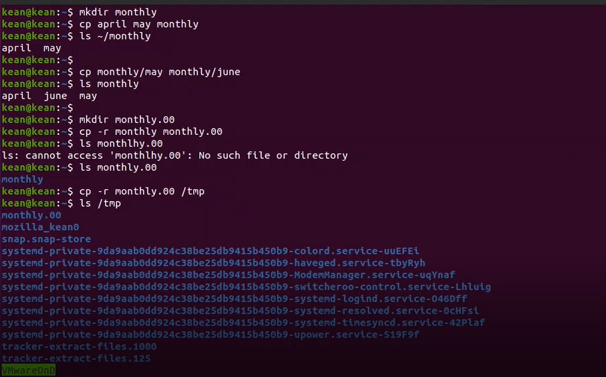{ #fig:002 width=70% }

   Перемещение и переименование файлов и каталогов
   
   Примеры:

   1. Переименование файлов в текущем каталоге. Изменить название файла april на july в домашнем каталоге:
   
   2. Перемещение файлов в другой каталог. Переместить файл july в каталог monthly.00:

  
   3. Переименование каталогов в текущем каталоге. Переименовать каталог monthly.00 в monthly.01:
  
   4. Перемещение каталога в другой каталог. Переместить каталог monthly.01 в каталог reports:
  
   5. Переименование каталога, не являющегося текущим. Переименовать каталог reports/monthly.01 в reports/monthly:

     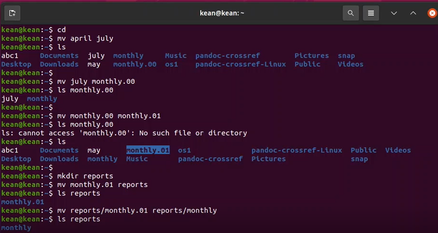{ #fig:002 width=70% }
   
   Изменение прав доступа

    Примеры:

    1. Требуется создать файл ~/may с правом выполнения для владельца:

    2. Требуется лишить владельца файла ~/may права на выполнение(u-x):

    3. Требуется создать каталог monthly с запретом на чтение для членов группы и всех остальных пользователей (g-r, o-r):

    4. Требуется создать файл ~/abc1 с правом записи для членов группы(g+w):

     .png){ #fig:003 width=70% }
     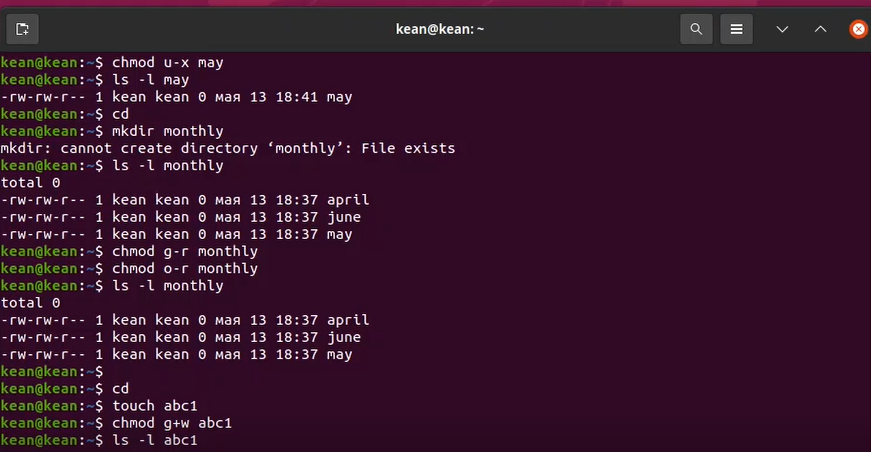{ #fig:003 width=70% }

2. Выполните следующие действия, зафиксировав в отчёте по лабораторной работе используемые при этом команды и результаты их выполнения:

    2.1. Скопируйте файл /usr/include/sys/io.h в домашний каталог и назовите его equipment. Если
файла io.h нет, то используйте любой другой файл в каталоге /usr/include/sys/ вместо него

     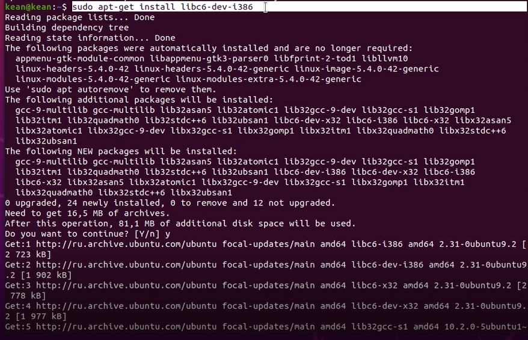{ #fig:004 width=70% }
    Сначала у меня возникла проблема с тем , что при запуске команды cd /usr/include/sys я не
смог найти файл usr/include/sys/, поэтому я установил его с помощью
sudo apt-get install libc6-dev-i386 , а затем он заработал.

    2.2. В домашнем каталоге создайте директорию ~/ski.plases :

    2.3. Переместите файл equipment в каталог ~/ski.plases (Команду mv):

    2.4. Переименуйте файл ~/ski.plases/equipment в ~/ski.plases/equiplist.

    2.5. Создайте в домашнем каталоге файл abc1 и скопируйте его в каталог ~/ski.plases, назовите его equiplist2:

    2.6. Создайте каталог с именем equipment в каталоге ~/ski.plases:

    2.7. Переместите файлы ~/ski.plases/equiplist и equiplist2 в каталог ~/ski.plases/equipment:

    2.8. Создайте и переместите каталог ~/newdir в каталог ~/ski.plases и назовите его plan:

    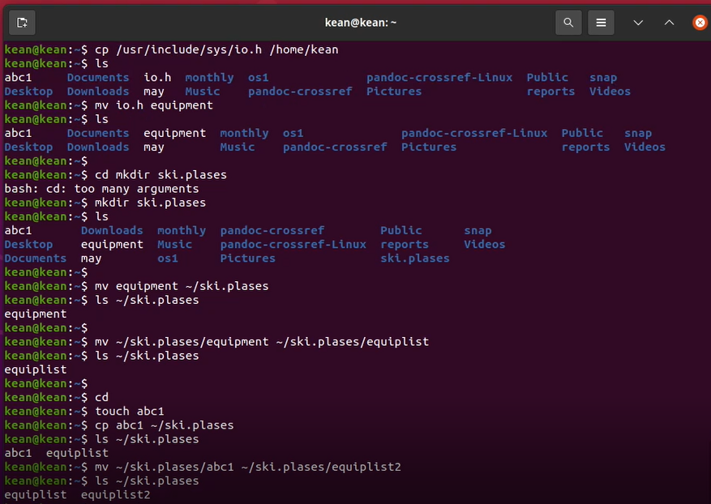{ #fig:005 width=70% }
    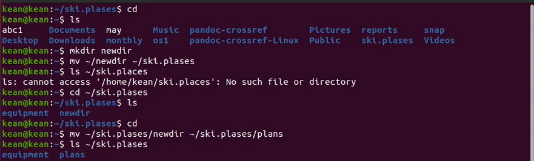{ #fig:006 width=70% }
    

3. Определите опции команды chmod:
   
   3.1. drwxr--r-- ... australia

   3.2. drwx--x--x ... play

   3.3. -r-xr--r-- ... my_os

   3.4. -rw-rw-r-- ... feathers
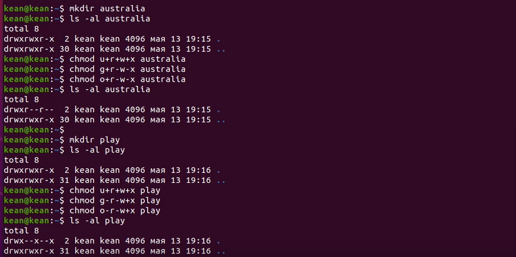{ #fig:007 width=70% }
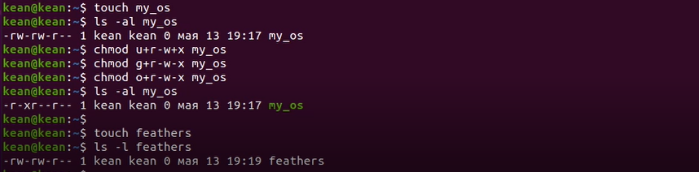{ #fig:008 width=70% }

4. Проделайте приведённые ниже упражнения, записывая в отчёт по лабораторной
работе используемые при этом команды

    4.1. Просмотрите содержимое файла /etc/password (с помощью командной cat )

    4.2.Скопируйте файл ~/feathers в файл ~/file.old. (с помощью команд cp и ls )

    4.3.Переместите файл ~/file.old в каталог ~/play. (с помощью команд mv )

    4.4. Скопируйте каталог ~/play в каталог ~/fun.

    4.5. Переместите каталог ~/fun в каталог ~/play(с помощью команд mv ) и назовите его games

    4.6. Лишите владельца файла ~/feathers права на чтение:

    4.7. Что произойдёт, если вы попытаетесь просмотреть файл ~/feathers командой cat?

    Там ничего не происходит, когда мы используем команду cat для просмотра файла ~/feathers .

    4.8. Что произойдёт, если вы попытаетесь скопировать файл ~/feathers?

    Там ничего не происходит, когда мы используем команду cat для просмотра файла ~/feathers .

    4.9. Дайте владельцу файла ~/feathers право на чтение с помощью команд chmod

    4.10. Лишите владельца каталога ~/play права на выполнение.

    4.11. Перейдите в каталог ~/play

    как мы видим, в разрешении отказано.

    4.12. Дайте владельцу каталога ~/play право на выполнение.

    сейчас он успешно, как и мы, свои права выполнение

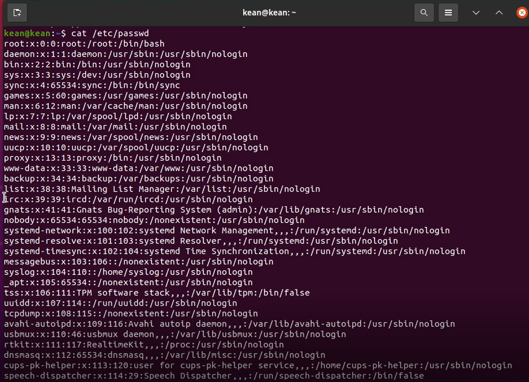{ #fig:009 width=70% }
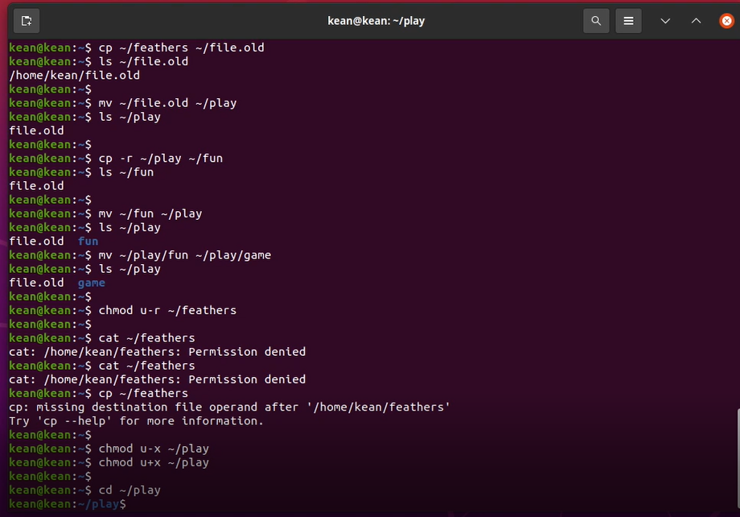{ #fig:010 width=70% }

5. Прочитайте man по командам mount, fsck, mkfs, kill и кратко их охарактеризуйте, приведя
примеры:

{ #fig:015 width=70% }

mount : Команда Mount присоединяет файловую систему внешнего устройства к файловой
системе системы. Он сообщает операционной системе, что файловая система готова к
использованию, и связывает ее с определенной точкой в иерархии системы. Монтирование
сделает файлы, каталоги и устройства доступными для пользователей
     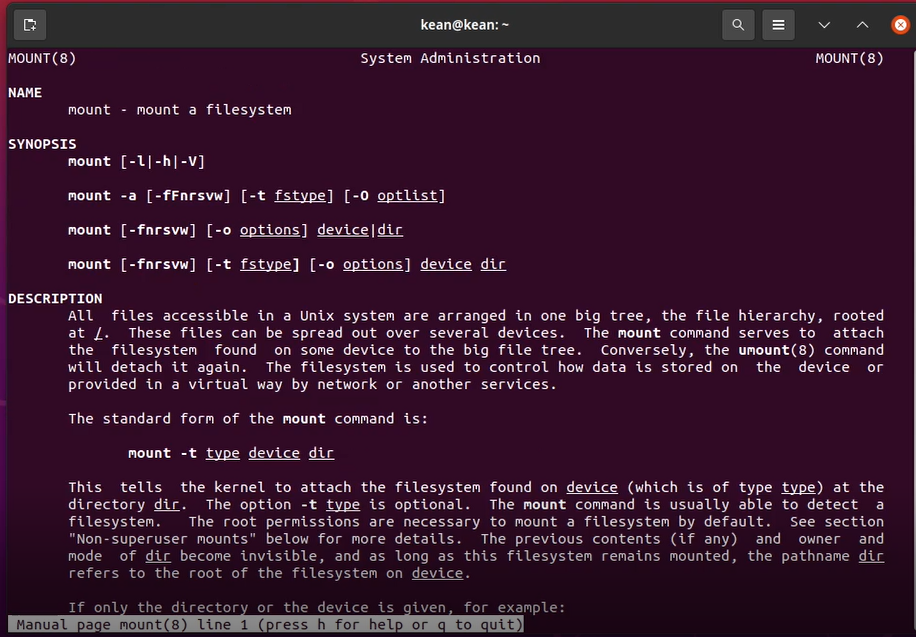{ #fig:011 width=70% }

fsck : (проверка файловой системы)-это утилита командной строки, которая позволяет
выполнять проверки согласованности и интерактивные исправления в одной или
нескольких файловых системах Linux. Вы можете использовать команду fsck для
восстановления поврежденных файловых систем в ситуациях, когда система не
загружается или раздел не может быть смонтирован
     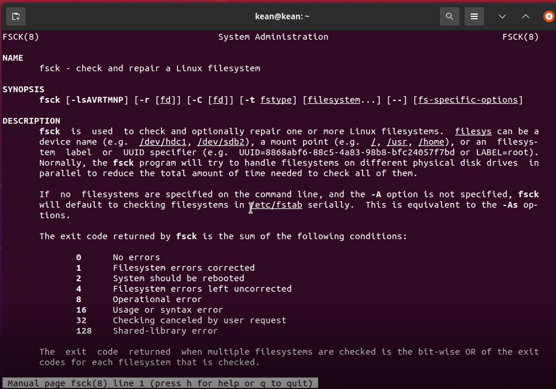{ #fig:012 width=70% }

mkfs : Команда mkfs расшифровывается как “создать файловую систему” и используется
для создания файловой системы (то есть системы для организации иерархии каталогов,
подкаталогов и файлов) на отформатированном устройстве хранения, как правило, разделе
на жестком диске (HDD) или это также может быть USB-накопитель и т. Д.
     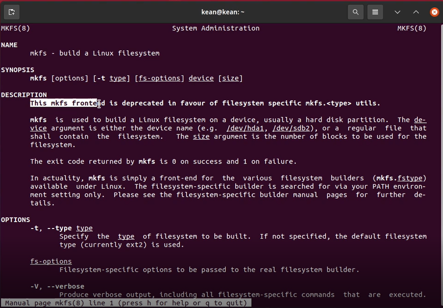{ #fig:013 width=70% }

kill : Команда kill посылает сигнал (по умолчанию сигнал SIGTERM) запущенному
процессу. Это действие по умолчанию обычно останавливает процессы.
     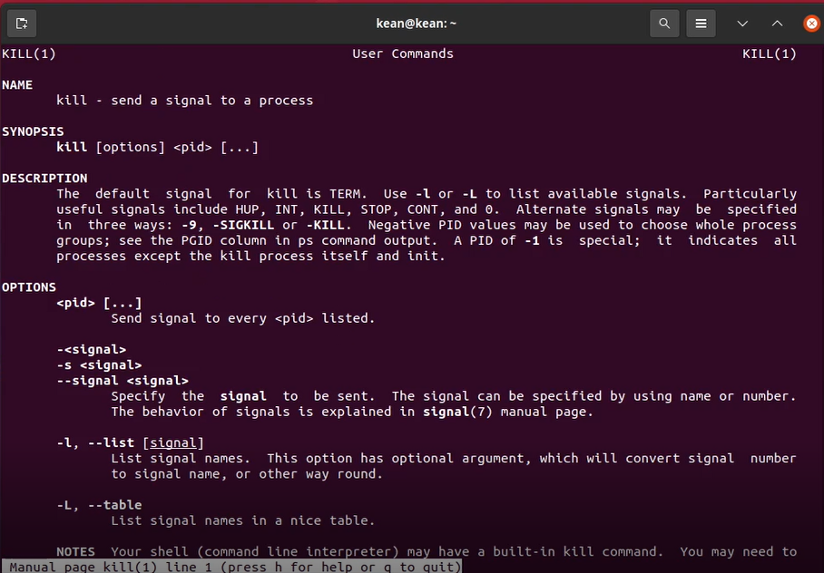{ #fig:014 width=70% }

# Контрольные вопросы

1. На моем компьютере установлена NTFS – основная файловая система семейства Windows NT.
    TmpFS — это быстрая и эффективная файловая система в ОЗУ, а не на ПЗУ, как прочие ФС. Предназначена для временного хранения файлов с оптимальным расходом памяти и скоростными характеристиками. Обычно используется при монтировании в каталог /tmp, в котором много постоянно меняющихся временных мелких файлов, поэтому может быть целесообразно размещать их в памяти.
    Ext4 - журналируемая файловая система, используемая в ОС на ядре Linux. Основана на файловой системе Ext3, но отличается тем, что в ней представлен механизм записи файлов в непрерывные участки блоков (екстенты), уменьшающий фрагментацию и повышающий производительность.

2. /bin - основные программы, необходимые для работы в системе: командные оболочки shell, основные утилиты

    /boot - каталог, который содержит ядро системы— главную программу, загружающую и исполняющую все остальные

    /dev - каталог, в котором содержатся псевдофайлы устройств. с точки зрения linux все физические устройства, как главные, так и периферийные, представляют собой файлы особого типа, в которые система может записывать данные и из которых она может их считывать. пользователь не должен работать с этими файлами, поскольку запись неправильных данных в файл устройства может повредить устройство или хранящиеся на нём данные

    /etc - в этом каталоге содержатся системные конфигурационные файлы — текстовые файлы, которые считываются при загрузке системы и запуске программ и определяют их поведение. настройка и администрирование linux в конечном итоге сводится к редактированию этих файлов, даже если оно выполняется при помощи графических средств конфигурирования системы

    /home - в структуре файловой системы linux каждый пользователь имеет отдельный личный каталог для своих данных (т.н. домашний каталог), и все пользовательские каталоги выделены в отдельный общий каталог /home

    /mnt - каталоги для монтирования файловых систем сменных устройств и внешних файловых систем

    /proc - файловая система на виртуальном устройстве, её файлы содержат информацию о текущем состоянии системы

    /root - каталог администратора системы

    /sbin - системные утилиты

    /usr - программы и библиотеки, доступные пользователю

    /var - рабочие файлы программ, различные временные данные: очереди (письма на отправку, файлы на печать и др.), системные журналы (файлы, в которые записывается информация о происходящих в системе событиях)

    /tmp - временные файлы

3. Для того чтобы содержимое некоторой файловой системы было доступно операционной системе, необходимо выполнить команду mount 
4. Основные причины нарушения целостности файловой системы: фппаратный сбой, программные прерывания, ошибка по вине человека. Команда fsck производит исправление файловой системы.
5. Создать файловую систему linux, семейства ext, на устройстве можно с помощью команды mkfs.
6. Для просмотра небольших файлов
удобно пользоваться командой cat.
Формат команды:
```cat имя-файла```
Для просмотра больших файлов используйте команду less — она позволяет осуществлять постраничный просмотр файлов (длина страницы соответствует размеру экрана).
Формат команды:
```less имя-файла```
7. Копирование файлов и каталогов осуществляется при помощи команды cp.
Формат команды:
cp [-опции] исходный_файл целевой_файл
CP может осуществлять Копирование файлов в текущий или произвольный каталог. 
8. Команды mv и mvdir предназначены для перемещения и переименования файлов и каталогов.
Формат команды mv:
```mv [-опции] старый_файл новый_файлё```
Позволяет делать: 
Переименование файлов в текущем каталоге;
Перемещение файлов в другой каталог;
Переименование каталогов в текущем каталоге;
Перемещение каталога в другой каталог;
Переименование каталога, не являющегося текущим;
9. Права доступа — совокупность правил, регламентирующих порядок и условия доступа субъекта к объектам информационной системы. Права доступа к файлу или каталогу можно изменить, воспользовавшись командой ```chmod```. Сделать это может владелец файла (или каталога) или пользовательс правами администратора.
 
# Вывод

Ознакомилась с файловой системой Linux, её структурой, именами и содержанием каталогов. Приобрела практические навыки по применению команд дляработы с файлами и каталогами, по управлению процессами (и работами), по проверке использования диска и обслуживанию файловой системы.
