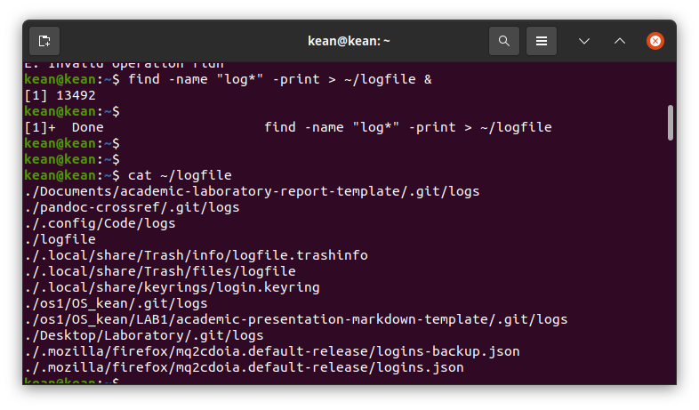

---
# Front matter
lang: ru-RU
title: "Лабораторная работа No 7"
subtitle: "Поиск файлов. Перенаправление ввода-вывода. Просмотр запущенных процессов"
author: "Кеан Путхеаро НПИбд-01-20"

# Formatting
toc-title: "Содержание"
toc: true # Table of contents
toc_depth: 2
lof: true # List of figures
lot: false # List of tables
fontsize: 12pt
linestretch: 1.5
papersize: a4paper
documentclass: scrreprt
polyglossia-lang: russian
polyglossia-otherlangs: english
mainfont: PT Serif
romanfont: PT Serif
sansfont: PT Sans
monofont: PT Mono
mainfontoptions: Ligatures=TeX
romanfontoptions: Ligatures=TeX
sansfontoptions: Ligatures=TeX,Scale=MatchLowercase
monofontoptions: Scale=MatchLowercase
indent: true
pdf-engine: lualatex
header-includes:
  - \linepenalty=10 # the penalty added to the badness of each line within a paragraph (no associated penalty node) Increasing the value makes tex try to have fewer lines in the paragraph.
  - \interlinepenalty=0 # value of the penalty (node) added after each line of a paragraph.
  - \hyphenpenalty=50 # the penalty for line breaking at an automatically inserted hyphen
  - \exhyphenpenalty=50 # the penalty for line breaking at an explicit hyphen
  - \binoppenalty=700 # the penalty for breaking a line at a binary operator
  - \relpenalty=500 # the penalty for breaking a line at a relation
  - \clubpenalty=150 # extra penalty for breaking after first line of a paragraph
  - \widowpenalty=150 # extra penalty for breaking before last line of a paragraph
  - \displaywidowpenalty=50 # extra penalty for breaking before last line before a display math
  - \brokenpenalty=100 # extra penalty for page breaking after a hyphenated line
  - \predisplaypenalty=10000 # penalty for breaking before a display
  - \postdisplaypenalty=0 # penalty for breaking after a display
  - \floatingpenalty = 20000 # penalty for splitting an insertion (can only be split footnote in standard LaTeX)
  - \raggedbottom # or \flushbottom
  - \usepackage{float} # keep figures where there are in the text
  - \floatplacement{figure}{H} # keep figures where there are in the text
---

# Цель работы

Ознакомление с инструментами поиска файлов и фильтрации текстовых дан-ных. Приобретение практических навыков: по управлению процессами (и задания-ми), по проверке использования диска и обслуживанию файловых систем.

# Задание

1. Осуществите вход в систему, используя соответствующее имя пользователя.
2. Запишите в файлfile.txtназвания файлов, содержащихся в каталоге/etc.Допишите в этот же файл названия файлов, содержащихся в вашем домашнемкаталоге.
3. Выведите имена всех файлов изfile.txt, имеющих расширение.conf, послечего запишите их в новый текстовой файлconf.txt.
4. Определите, какие файлы в вашем домашнем каталоге имеют имена, начинав-шиеся с символаc? Предложите несколько вариантов, как это сделать.
5. Выведите на экран (по странично) имена файлов из каталога/etc, начинающи-еся с символаh.
6. Запустите в фоновом режиме процесс, который будет записывать в файл~/logfileфайлы, имена которых начинаются сlog.
7. Удалите файл~/logfile.
8. Запустите из консолив фоновом режимередакторgedit.
9. Определите идентификатор процессаgedit, используя командуps, конвейер ифильтрgrep. Можно ли определить этот идентификатор более простым спосо-бом?
10. Прочтите справку (man) командыkill, после чего используйте её для заверше-ния процессаgedit.
11. Выполните командыdfиdu, предварительно получив более подробную инфор-мацию об этих командах, с помощью командыman.
12. Воспользовавшись справкой командыfind, выведите имена всех директорий,имеющихся в вашем домашнем каталоге.


# Выполнение лабораторной работы

1. Войдите в систему, используя соответствующее имя пользователя.

2. Запишите в файл file.txt названия файлов, содержащихся в каталоге /etc. Допишите в этотже файл названия файлов, содержащихся в вашем домашнемкаталоге:

{ #fig:001 width=70% }

для этого мы перенаправляем (>) с помощью команды ls/etc (файл, который содержится вкаталоге /etc) в file.txt. Затем используйте (>>) в том же файле и проверьте выводсодержимого file.txt с помощью командной cat.

3. Выведите имена всех файлов из file.txt, имеющих расширение .conf, после чегозапишите их в новый текстовой файл conf.txt: для этого мы используем помощь команды grep

{ #fig:002 width=70% }

Теперь мы напишем им новый текстовый файл conf.txt с помощью команды grep и проверкирезультата с помощью команды cat

{ #fig:003 width=70% }

4. Определите, какие файлы в вашем домашнем каталоге имеют имена, начинавшиеся ссимвола c:

{ #fig:004 width=70% }

Для этого мы используем конвейер следующей команды ls-l (для просмотра содержимогодомашнего каталога) и команды grep c* (для поиска файла, начинающегося с символа c)

5. Выведите на экран (по странично) имена файлов из каталога /etc, начинающиеся с символаh:

{ #fig:005 width=70% }

{ #fig:006 width=70% }

для этого мы используем командуfind /etc( для поиска в каталоге /etc), а затем используемpipeline less

6. Запустите в фоновом режиме процесс, который будет записывать в файл ~/logfile файлы,имена которых начинаются с log:

{ #fig:007 width=70% }

Основные опции cd - переходить по ссылкам и выдавать ошибку если директория не найдена

7. Удалите файл ~/logfile:Мы используем команду rm для удаления файла и для проверки результата мы используемкоманду cat, и мы видим, что файл ~/logfile успешно удален

{ #fig:008 width=70% }

8. Запустите из консоли в фоновом режиме редактор gedit:

{ #fig:009 width=70% }

9. . Определите идентификатор процесса gedit, используя команду ps, конвейер ифильтр grep: Мы можем найти идентификатор с помощью команды pgrep gedit, котораявыводит только ID ( рис.10 ). Идентификатор 13934.

10. Прочтите справку (man) команды kill, после чего используйте её для завершения процессаgedit:

{ #fig:010 width=70% }

{ #fig:011 width=70% }

11. Выполните команды df и du, предварительно получив более подробную информацию обэтих командах, с помощью команды man:

{ #fig:012 width=70% }

{ #fig:013 width=70% }

{ #fig:014 width=70% }

{ #fig:015 width=70% }

12. Воспользовавшись справкой команды find, выведите имена всех директорий, имеющихся ввашем домашнем каталоге:

Мы используем команду find ~ -type d, где:
  - ~: обозначение вашего домашнего каталога
  - -type: опция для определенных типов
  - d (directory): типа каталог

{ #fig:016 width=70% }

# Контрольные вопросы

1. stdin — стандартный поток ввода (по умолчанию: клавиатура), файловый дескриптор 0;
2. /> - открытие файла для перенаправления потока.
/» - файл открывается в режиме добавления.
3. Конвейер (pipe) служит для объединения простых команд или утилит в цепочки,в которых результат работы предыдущей команды передаётся последующей. Синтаксис следующий:
команда 1 | команда 2
означает, что вывод команды 1 передастся на ввод команде 2
4. Процессы в linux можно описать как контейнеры, в которых хранится вся информация о состоянии и выполнении программы.
5. Process IDentifier, PID) — уникальный номер (идентификатор процесса. (GID) - обозначает группу, к которой относится пользователь.
6. Запущенные фоном программы называются задачами (jobs). Ими можно управлять с помощью команды jobs, которая выводит список запущенных в данный момент задач.
7. top - позволяет выводить информацию о системе, а также список процессов динамически обновляя информацию о потребляемых ими ресурсах.
Команда htop похожа на команду top по выполняемой функции: они обе показывают информацию о процессах в реальном времени, выводят данные о потреблении системных ресурсов и позволяют искать, останавливать и управлять процессами.
В программе htop реализован очень удобный поиск по процессам, а также их фильтрация.
8. Команда find используется для поиска и отображения имён файлов, соответствующих заданной строке символов.
Формат команды:
find путь [-опции]
Путь определяет каталог, начиная с которого по всем подкаталогам будет вестисьпоиск.
Пример:
Вывести на экран имена файлов из вашего домашнего каталога и его подкаталогов, начинающихся на f:
```find ~ -name "f*" -print```
где ~ — обозначение вашего домашнего каталога, -name — после этой опции указывается имя файла, который нужно найти, "f*" — строка символов, определяющая имя файла, -print — опция, задающая вывод результатов поиска на экран.
9. Можно ли по контексту (содержанию) найти файл используя комбинацию команд find и grep. ```find -type f -exec grep -H 'текстДляПоиска' ```
10. определить объем свободной памяти на жёстком диске можно с помощью```df -h```
11. Определить объем домашнего каталога можно командой ```du -s```
12. Для завершения процесса необходимо выполнить команду
```kill %номер задач```

# Вывод
> Познакомился с инструментами поиска файлов и фильтрации текстовых данных. Получил практические навыки управления процессами (и заданиями), проверки использования диска и обслуживания файловых систем.