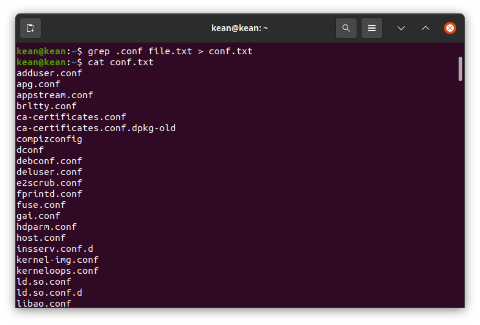
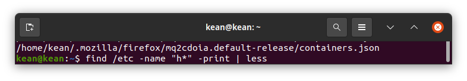
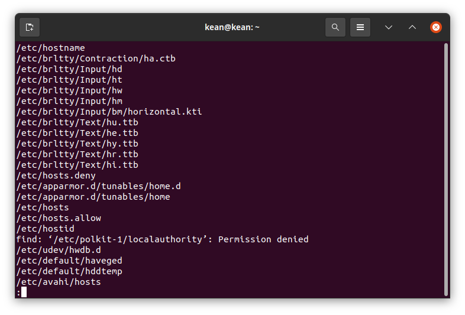
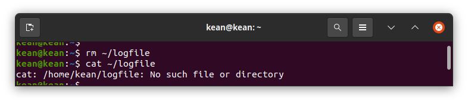
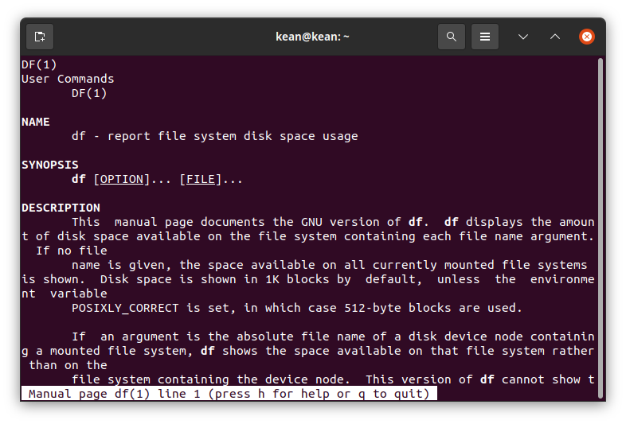
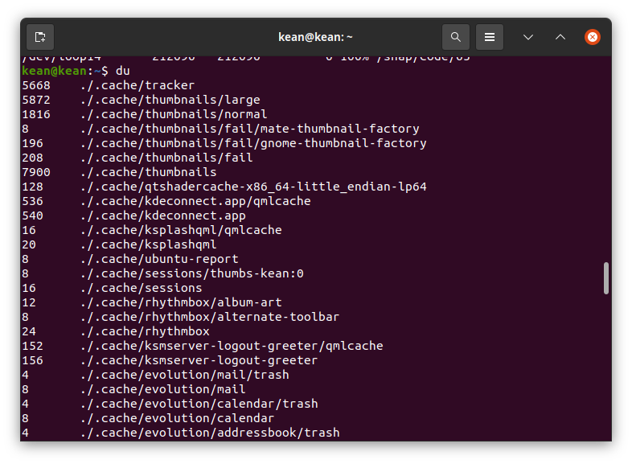

---
## Front matter
lang: ru-RU
title: Поиск файлов. Перенаправление ввода-вывода. Просмотр запущенных процессов
author: |
	 Кеан Путхеаро НПИбд-01-20\inst{1}

institute: |
	\inst{1}Российский Университет Дружбы Народов

date: 13 мая, 2021, Москва, Россия

## Formatting
mainfont: PT Serif
romanfont: PT Serif
sansfont: PT Sans
monofont: PT Mono
toc: false
slide_level: 2
theme: metropolis
header-includes: 
 - \metroset{progressbar=frametitle,sectionpage=progressbar,numbering=fraction}
 - '\makeatletter'
 - '\beamer@ignorenonframefalse'
 - '\makeatother'
aspectratio: 43
section-titles: true

---

# Цели и задачи работы

## Цель лабораторной работы

Ознакомление с инструментами поиска файлов и фильтрации текстовых дан-ных. Приобретение практических навыков: по управлению процессами (и задания-ми), по проверке использования диска и обслуживанию файловых систем.

## Задачи лабораторной работы

1. Осуществите вход в систему, используя соответствующее имя пользователя. 
2. Запишите в файлfile.txtназвания файлов, содержащихся в каталоге/etc.Допишите в этот же файл названия файлов, содержащихся в вашем домашнемкаталоге.
3. Выведите имена всех файлов изfile.txt, имеющих расширение.conf, послечего запишите их в новый текстовой файлconf.txt.
4. Определите, какие файлы в вашем домашнем каталоге имеют имена, начинав-шиеся с символаc? Предложите несколько вариантов, как это сделать.

## Задачи лабораторной работы

5. Выведите на экран (по странично) имена файлов из каталога/etc, начинающи-еся с символаh.
6. Запустите в фоновом режиме процесс, который будет записывать в файл~/logfileфайлы, имена которых начинаются сlog.
7. Удалите файл~/logfile.
8. Запустите из консолив фоновом режимередакторgedit.

## Задачи лабораторной работы

9. Определите идентификатор процессаgedit, используя командуps, конвейер ифильтрgrep. Можно ли определить этот идентификатор более простым спосо-бом?
10. Прочтите справку (man) командыkill, после чего используйте её для заверше-ния процессаgedit.
11. Выполните командыdfиdu, предварительно получив более подробную инфор-мацию об этих командах, с помощью командыman.
12. Воспользовавшись справкой командыfind, выведите имена всех директорий,имеющихся в вашем домашнем каталоге.

# Процесс выполнения лабораторной работы

## Запись в файл file.txt

{ #fig:001 width=70% }

## Вывод файл из file.txt имеющих расширение .conf

{ #fig:002 width=70% }

## запись имен файл, .conf в файл conf.txt

{ #fig:003 width=70% }

## поиск файлб начинающихся с символа с

{ #fig:004 width=70% }

## Вывод файлов начинающиеся с символа h

{ #fig:005 width=70% }

## Вывод файлов начинающиеся с символа h

{ #fig:006 width=70% }

## фоновая запись в ~/logfile

{ #fig:007 width=70% }

## далите файл ~/logfile

{ #fig:008 width=70% }

## gedit

{ #fig:009 width=70% }

## удаление процесса gedit

{ #fig:010 width=70% }

## man kill

{ #fig:011 width=70% }

## Команд man df

{ #fig:012 width=70% }

## команд man du

{ #fig:013 width=70% }

## df

{ #fig:014 width=70% }

## du

{ #fig:015 width=70% }

## вывод директорий домашнего каталога 

{ #fig:016 width=70% }

# Выводы по проделанной работе

## Вывод

Познакомился с инструментами поиска файлов и фильтрации текстовых данных. Получил практические навыки управления процессами (и заданиями), проверки использования диска и обслуживания файловых систем.